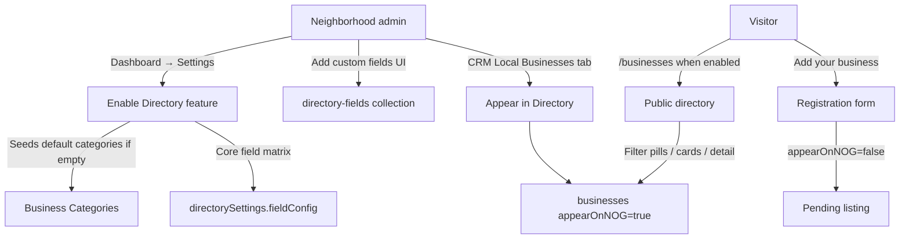

# Business Directory (tenant feature)

Tenant-enableable local business directory inspired by [The Avenues DSM businesses listing](https://www.theavenuesdsm.com/businesses/), styled for North Of Grand (Gentium/Playfair feel, `#76b3b8` accent, soft green-gray type) rather than copying Avenues chrome wholesale.

## Feature overview



## Enable for a tenant (UI)

1. Sign in as **admin** / **superadmin**.
2. Open **Dashboard → Settings**.
3. Under **Business Directory**, check **Enable Directory feature**.
4. Set page title / intro, public registration, and nav link as needed.
5. Click **Save directory settings**.
6. Visit `/businesses` on that tenant host.

First enable seeds default categories (Food & Drink, Shopping, Services, …) when none exist.

NOG is the first implementer: enable via Settings (or run `pnpm exec tsx src/scripts/enable-nog-directory.ts` locally).

## Configure core fields (UI)

In **Settings → Business Directory → Core fields**, toggle per field:

| Column | Meaning |
| ------ | ------- |
| On | Field is part of the directory schema UX |
| Required | Required on the public registration form |
| Card | Shown on directory cards |
| Detail | Shown in the detail panel |
| Form | Shown on “Add your business” |

Core keys: name, logo, coverImage, address, phone, email, website, hours, about, categories, facebook, instagram.

**Save directory settings** after changing the matrix.

## Add custom fields (UI)

1. Enable Directory.
2. In **Custom directory fields**, enter **Label**, **camelCase key**, and type (text / number / checkbox / select / url).
3. Click **Add field**.
4. Values are stored on each business under `customAttributes[key]` and appear on the registration form / detail view according to field flags (editable in Payload Admin → Directory Fields for advanced options).

## Categories (UI)

**Settings → Categories**: add or delete filter pills. Assign categories on each business in Payload Admin or during registration (when Categories is enabled on the form).

## Architecture

```mermaid
flowchart LR
  subgraph tenantCfg [Tenant]
    E[enableBusinessDirectory]
    S[directorySettings]
  end
  subgraph colls [Tenant-scoped collections]
    B[businesses]
    C[business-categories]
    D[directory-fields]
  end
  E --> Public[/businesses]
  E --> CRM[CRM Local Businesses tab]
  E --> Nav[Optional nav link]
  S --> Public
  C --> Public
  D --> Public
  B --> Public
```

### Data model notes

- Visibility flag remains `appearOnNOG` in the database (label: **Appear in Directory**) for backward compatibility.
- `coverImage` + `logo` support Avenues-style image-forward cards.
- Multi-tenant plugin scopes `businesses`, `business-categories`, and `directory-fields`.

## Public UX principles

- **Avenues patterns kept:** category pills, sort, image-led cards, detail contact/hours blocks, “add your business”.
- **NOG identity kept:** serif titles (`#42514c`), muted body (`#7b8c89`), teal accent (`#76b3b8`), soft radial wash — not Avenues black/cart chrome.
- Cards open an in-page detail panel (no full page reload); images use `loading="lazy"`.

## Gating

| Surface | When directory disabled |
| ------- | ----------------------- |
| `/businesses` | `404` |
| Header “Businesses” | Hidden (unless already in CMS nav) |
| CRM “Local Businesses” | Tab hidden |
| Registration API | Rejects submissions |

## Related code

- Collections: `Businesses.ts`, `BusinessCategories.ts`, `DirectoryFields.ts`, `Tenants/index.ts`
- Public: `app/(frontend)/[tenant]/(public)/businesses/`
- Settings UI: `dashboard/settings/DirectorySettings.tsx`
- Constants: `src/directory/constants.ts`
