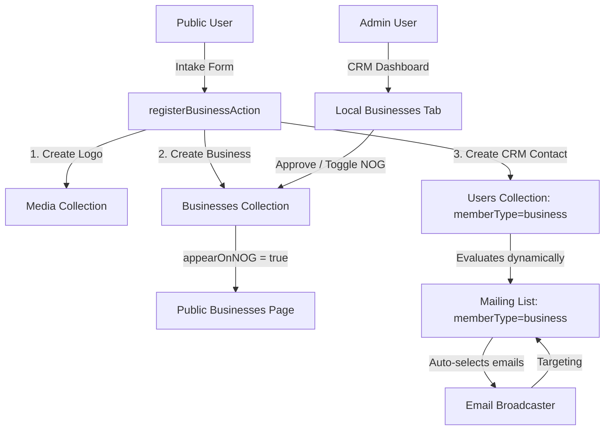

# Local Businesses Directory & CRM Integration

This feature adds a tenant-specific **Local Businesses Directory**, a public **Self-Registration Intake Form**, and integrates them with the **CRM Admin Dashboard** and **Email Broadcaster**.

---

## 1. Architectural Overview

The integration follows a registration-approval-broadcasting pipeline:

---

## 2. Technical Implementation Details

### Database Collections Configurations
1.  **`Businesses` Collection (`src/collections/Businesses.ts`):** 
    Stores business profiles. Scoped per-tenant. Key fields:
    *   `logo`: Relationship to `media` collection.
    *   `name`, `address`, `website`, `email`, `about`, `hours`.
    *   `appearOnNOG`: Checkbox determining public directory visibility.
2.  **`Users` Collection Extensions (`src/collections/Users/index.ts`):**
    *   `memberType`: Dropdown option to segment contacts (`residential`, `business`, `other`).
    *   `customAttributes`: Dynamic JSON attributes for custom tagging.
3.  **`Media` Collection Scoping:** Scoped to multi-tenant to isolate business logos per community.

### Backend Integrations & Server Actions
*   **`registerBusinessAction`:** Decodes base64 logo files sent from the frontend client, uploads them to the `media` collection, registers the business in the `businesses` collection, and upserts a corresponding CRM contact in `users` with `memberType = "business"` and `status = "approved"`.
*   **`getBusinessesAction`:** Queries businesses per tenant. Publicly filters by `appearOnNOG = true` to hide unapproved submissions.
*   **`getCRMBusinessesAction` & `toggleBusinessNOGAction`:** Handles admin panel directory viewing and approval toggles.

### Frontend Components
*   **Businesses Directory page (`[tenant]/businesses`):** Public route rendering a grid of registered, approved businesses. Includes an "Add Your Business" button opening the intake form modal.
*   **Intake Form Modal:** A self-contained modal collecting details, converting uploaded files to base64, performing validations, and executing the server actions.
*   **CRM Admin Dashboard (`CRMTabs.tsx`):** Added a **"Local Businesses"** tab listing all submissions under the tenant. Allows admins to review data, check/toggle approval (`Appear on NOG`), and delete entries.
*   **Broadcaster Selection:** Dynamic list rules compile via `compileRulesToQuery` to match `memberType = "business"`, automatically checking matching business contacts in the Email Broadcaster interface.

---

## 3. Testing & E2E Validation

Playwright E2E browser tests are located in [tests/e2e/businesses-directory.e2e.spec.ts](file:///Users/eugen/dev/blockvibe/blockvibe-monorepo/apps/payload-web/tests/e2e/businesses-directory.e2e.spec.ts). The test verifies:
1.  Registration of a business through the public form.
2.  Page reloading to verify it is hidden publicly by default.
3.  Logging in as NOG admin, opening the "Local Businesses" CRM tab, and checking the approval toggle.
4.  Verification of public visibility on the businesses page.
5.  Creating a dynamic mailing list in CRM matching `memberType = business` and checking the eval list preview.
6.  Broadcaster list selection auto-checking the registered business email, composing a broadcast, and verifying the successful delivery trigger.
7.  Clean database teardown of all test logs, fields, users, and media.
