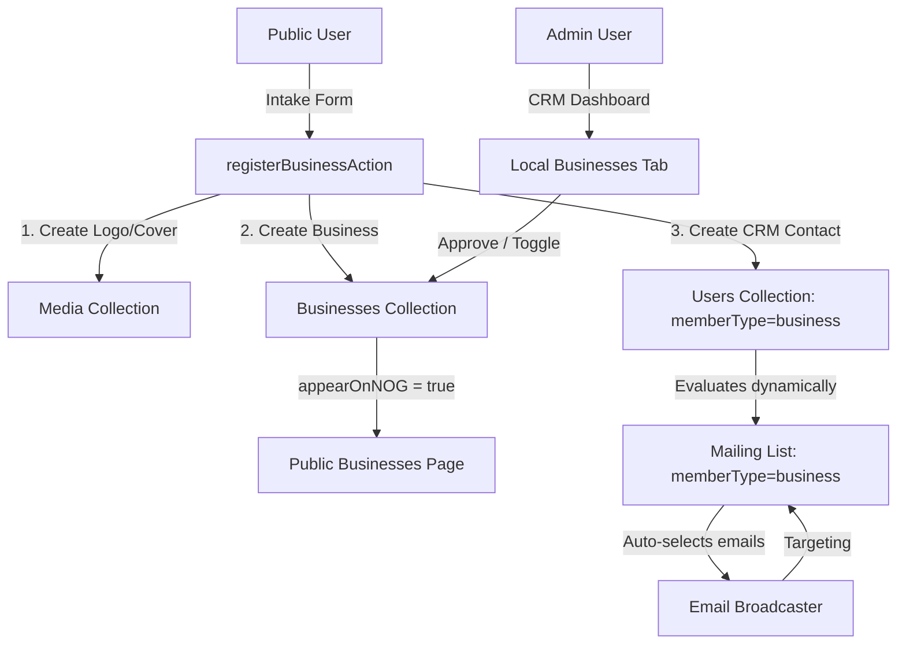

# Local Businesses Directory & CRM Integration

> **Canonical feature doc:** [business_directory_feature.md](./business_directory_feature.md) — Enable Directory, configurable fields, CRM sync, passwords, mermaid design.  
> **CRM groups:** [crm_groups_and_segmentation.md](./crm_groups_and_segmentation.md) — Member Type, tags/attributes, mailing lists.

This feature adds a tenant-specific **Local Businesses Directory**, a public **Self-Registration Intake Form**, and integrates them with the **CRM Admin Dashboard** and **Email Broadcaster**.

## Status: Avenues-style redesign (NOG-first)

Implemented as a **tenant feature flag** (`enableBusinessDirectory`) with:

- Image-forward cards (cover + logo), category filter pills, sort, infinite scroll (10 per page)
- Dedicated detail pages at `/businesses/[slug]`
- Configurable core fields + custom `directory-fields`
- Tenant-scoped `business-categories`
- NOG visual language (teal accent, serif titles) inspired by — not copied from — [The Avenues](https://www.theavenuesdsm.com/businesses/)

**Admin how-to** (Settings, CRM approval, Payload edit, owner My Business): see [business_directory_feature.md — How admins edit the directory](./business_directory_feature.md#how-admins-edit-the-directory).

## Architectural Overview

## Collections

1. **`businesses`** — profiles: name, logo, coverImage, address, phone, email, website, hours, about, categories, socials, customAttributes, appearOnNOG (Appear in Directory).
2. **`business-categories`** — filter pills (tenant-scoped).
3. **`directory-fields`** — custom field definitions (tenant-scoped).
4. **`tenants.enableBusinessDirectory` + `directorySettings`** — feature toggle and field matrix.

## Testing

Playwright: `tests/e2e/businesses-directory.e2e.spec.ts` (requires Directory enabled for NOG).
