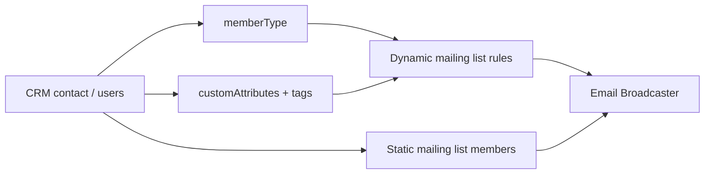

# CRM groups & contact segmentation

How neighborhood admins organize contacts for filtering and email — without a separate “Groups” product.

## Three layers

| Layer | Purpose | Admin UI |
| ----- | ------- | -------- |
| **Member Type** | Built-in bucket on every contact | CRM Directory → Type filter |
| **Tags & Custom Attributes** | Admin-defined labels | Contact editor + Custom Attributes tab |
| **Mailing Lists** | Who receives broadcasts | Mailing Lists tab (static or dynamic) |

## Built-in: Member Type

Values: `residential` | `business` | `other`.

- Residents / neighbors → usually `residential`
- Business directory registrants (and approved listings) → `business`
- Partners / other → `other`

Business directory approval keeps the contact on `memberType: business` and includes them in the seeded **Approved Businesses** dynamic list.

## Admin-defined: Tags & attributes

### Tags (quick presets)

On a contact, admins can apply presets such as Landlord, Tenant, Homeowner Resident, HOA Board, Volunteer. The Directory tab can filter by tag (e.g. Landlords).

### Custom Attributes schema

**CRM → Custom Attributes**: define fields (text, number, checkbox, select).

When **Business Directory** is enabled, we seed:

- **Label:** Resident Category  
- **Key:** `residentCategory`  
- **Options:** Landlord, Tenant, Homeowner Resident, HOA Board Member  

Use this (or tags) for landlord/tenant/homeowner segmentation.

## Mailing Lists = the groups you email

| Type | Behavior |
| ---- | -------- |
| **Static** | Admin picks members by hand (Block Captains, Event Committee). |
| **Dynamic** | Rules auto-include matching contacts (always up to date). |

### Seeded list: Approved Businesses

Created when Directory is enabled (if missing):

- Name: `Approved Businesses`
- Type: dynamic  
- Rule: `memberType` **equals** `business`

### Example dynamic lists

| List name | Rule idea |
| --------- | --------- |
| Approved Businesses | `memberType` equals `business` |
| Active Landlords | `customAttributes.residentCategory` equals `Landlord` (or tag Landlord) |
| Homeowners | `customAttributes.residentCategory` equals `Homeowner Resident` |

## Business directory ↔ CRM

Full flow (registration, approval email, passwords):  
[business_directory_feature.md](./business_directory_feature.md#crm-sync-approval-email-and-passwords).

## Why not a dedicated Groups collection?

Attributes + dynamic lists already support landlords/tenants/homeowners/businesses without schema deploys. Add a multi-select “groups” field only if admins find tags/attributes too limiting for overlapping badges.
