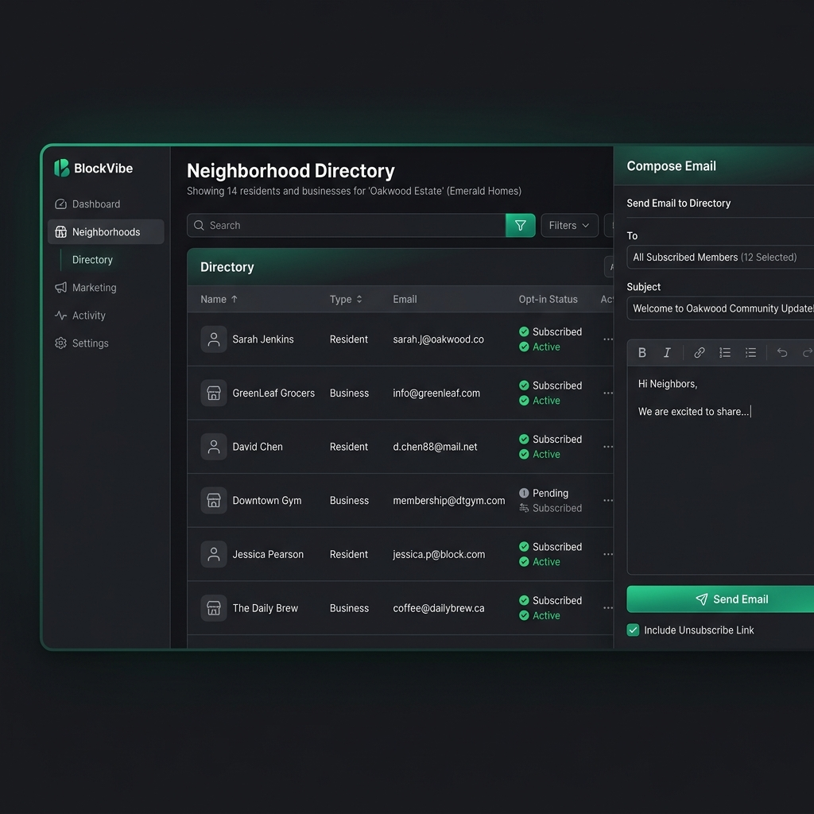

# BlockVibe CRM Implementation Plan (Approach A: Isolated Frontend Dashboard)

This document details the implementation plan for adding lightweight CRM features (Residents & Businesses directory, and a newsletter/email broadcast tool) to the BlockVibe multi-tenant platform.

To maintain simplicity and prevent non-technical neighborhood administrators from being confused by the core Payload CMS `/admin` panel, we will implement **Approach A**: a completely isolated frontend portal at `/[tenant]/dashboard`.

---

## 1. User Interface Wireframe

Below is the design mockup for the custom frontend dashboard showing the Directory and the Email Composer drawer:



---

## 2. Database Collection Design

We will define a unified `Contacts` collection in Payload CMS. Using a unified collection makes searching, filtering, and multi-selection for email broadcasts simpler and cleaner.

### Collection Schema: `contacts`
* **File:** `src/collections/Contacts.ts`
* **Fields:**
  * `name` (Text, Required) - Full name of the resident or name of the business.
  * `type` (Select, Required) - Options: `['resident', 'business']`.
  * `email` (Email, Required, Unique within the tenant scope).
  * `phone` (Text, Optional).
  * `unsubscribed` (Checkbox, Default: `false`) - Indicates if the contact opted out of emails.
  * `tenant` (Relationship to `tenants` collection) - Automatically injected and handled by the `@payloadcms/plugin-multi-tenant` plugin.

### Hiding from Technical `/admin` Sidebar
To keep the standard admin panel clean, we will hide the raw `contacts` list from standard users. It will only be visible to Super Admins.
```typescript
// inside Contacts collection config
admin: {
  hidden: ({ user }) => {
    // Only show to super-admins in the back-office
    const SUPER_ADMIN_EMAILS = ['eugen8@gmail.com'];
    return !user?.email || !SUPER_ADMIN_EMAILS.includes(user.email);
  }
}
```

---

## 3. Directory & Component Structure

We will add the following pages and components under the `(frontend)` app group:

```
src/
├── collections/
│   └── Contacts.ts             # [NEW] Contacts database schema
├── app/
│   └── (frontend)/
│       └── [tenant]/
│           ├── dashboard/      # [NEW] Isolated Frontend Portal
│           │   ├── layout.tsx  # Checks auth, renders sidebar
│           │   ├── page.tsx    # Dashboard home / stats
│           │   └── crm/        # Directory list & composer
│           │       └── page.tsx
│           └── unsubscribe/    # [NEW] Public opt-out route
│               └── page.tsx    
```

---

## 4. Security & Access Control

1. **Authentication:**
   We will verify user sessions inside `src/app/(frontend)/[tenant]/dashboard/layout.tsx` using Payload's native authentication helper:
   ```typescript
   import { getPayload } from 'payload'
   import configPromise from '@payload-config'
   import { headers } from 'next/headers'
   import { redirect } from 'next/navigation'

   const payload = await getPayload({ config: configPromise })
   const { user } = await payload.auth({ headers: await headers() })

   if (!user) {
     redirect(`/${tenant}/login`)
   }
   ```

2. **Tenant Scoping:**
   We must ensure the logged-in user has permission to manage the current `tenant`.
   * The `@payloadcms/plugin-multi-tenant` plugin automatically restricts user accounts to specific tenants.
   * If a user is registered under `nog` (North of Grand), their database queries for `contacts` are automatically filtered to only return Contacts matching the `nog` tenant ID.

---

## 5. Outbound Email & Anti-Spam Architecture

We will configure email delivery using **AWS SES** (or a developer-friendly service like **Resend**) via the Payload email config:

### Config integration (`src/payload.config.ts`)
```typescript
import { nodemailerSendgrid } from '@payloadcms/email-sendgrid' // or custom SMTP for SES

export default buildConfig({
  // ...
  email: {
    transportOptions: {
      host: process.env.SMTP_HOST,
      port: Number(process.env.SMTP_PORT),
      auth: {
        user: process.env.SMTP_USER,
        pass: process.env.SMTP_PASS,
      },
    },
    defaultFromAddress: 'noreply@mail.blockvibe.org',
    defaultFromName: 'BlockVibe Alerts',
  },
})
```

### Unsubscribe (Opt-Out) Flow
* Every email campaign sent from the composer will append a customized HTML footer:
  ```html
  <p style="font-size: 12px; color: #666;">
    You are receiving this because you are registered as a resident or business in the neighborhood.
    <a href="https://{{tenant_domain}}/unsubscribe?email={{email_address}}&token={{opt_out_token}}">Unsubscribe</a>
  </p>
  ```
* Clicking the link directs the user to `src/app/(frontend)/[tenant]/unsubscribe/page.tsx` which verifies the secure token (e.g. a hash of the email and the `PAYLOAD_SECRET`) and updates the `unsubscribed` field of the matching contact to `true`.
* **Safety check in Server Action:** The bulk-sending script will explicitly check `unsubscribed != true` before invoking the email transport.

---

## 6. Implementation Checklist

- [ ] **Step 1: Database Collection**
  - Create `src/collections/Contacts.ts`.
  - Wire it into [src/payload.config.ts](file:///Users/eugen/dev/blockvibe/experiments/04-payload-multitenant/src/payload.config.ts).
  - Update `src/plugins/index.ts` to include `contacts: {}` in the `multiTenantPlugin` config.
- [ ] **Step 2: SMTP Configuration**
  - Add SMTP credentials to `.env`.
  - Configure `email` transport in [src/payload.config.ts](file:///Users/eugen/dev/blockvibe/experiments/04-payload-multitenant/src/payload.config.ts).
- [ ] **Step 3: Unsubscribe Route**
  - Build public unsubscribe page at `src/app/(frontend)/[tenant]/unsubscribe/page.tsx`.
- [ ] **Step 4: Frontend Layout & Sidebar Component**
  - Build dashboard page layouts with sidebar navigation matching the wireframe style.
- [ ] **Step 5: Directory & Search Features**
  - Implement contacts listing table with pagination, type filtering, and search options.
- [ ] **Step 6: Email Composer Panel**
  - Build slide-out compose drawer.
  - Implement bulk emailing Server Action with anti-spam check.
