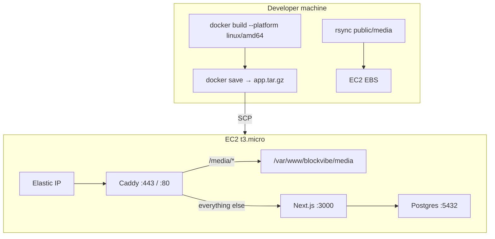
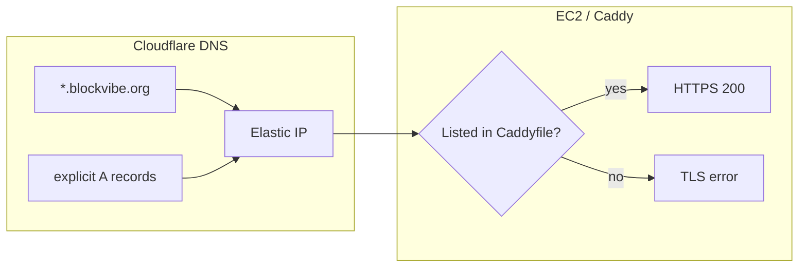

# Blockvibe Multitenant Deployment Guide

Self-hosted deployment on a single AWS EC2 instance: Next.js + Payload + Postgres + Caddy.

---

## Quick reference

| Phase | Command |
| --- | --- |
| **First-time infra** | `cd infra && terraform init && terraform apply` |
| **First-time env** | `cp .env.production.example .env.production` (edit secrets) |
| **Deploy (every time)** | `./infra/deploy.sh` |
| **Code-only deploy** | `./infra/deploy.sh --skip-media` |
| **Media-only sync** | `./infra/sync-media.sh` |
| **Push local DB → prod** | `./infra/push-db-to-prod.sh` |
| **Seed prod content only** | `pnpm seed:prod-content` |
| **Sync prod schema (no full replace)** | `./infra/sync-prod-schema.sh` |

See also: [infra/README.md](../../infra/README.md) · [src/scripts/README.md](../../src/scripts/README.md) (seeding) · **[production-flows.md](production-flows.md)** (day-to-day prod workflows)

---

## Production flows (summary)

Full step-by-step workflows: **[docs/deployment/production-flows.md](production-flows.md)**

| I want to… | Command |
| ---------- | ------- |
| Ship new app code | `./infra/deploy.sh` or `--skip-media` |
| Fix `info` landing / NOG users only | `pnpm seed:prod-content` → restart payload |
| Copy entire local DB to prod | `./infra/push-db-to-prod.sh` |
| Add DB tables after code change | `./infra/sync-prod-schema.sh` |
| Sync media files only | `./infra/sync-media.sh` |
| Verify all e2e | `pnpm test:e2e:prod` |

Typical release: **deploy** → (schema sync if needed) → **e2e**. Content-only fixes: **seed:prod-content** → **restart** → **e2e**.

---

## 1. Architectural overview



### Why we build locally

`next build` is too heavy for a 1 GB RAM `t3.micro`. The deploy script compiles on your machine, ships a pre-built Docker image, and the server only loads and runs it.

---

## 2. Cost

| Resource | ~Cost |
| --- | --- |
| EC2 `t3.micro` | $7.50/mo (free tier eligible) |
| EBS 20 GB gp3 | $1.60/mo (free tier eligible) |
| Postgres in Docker | $0 |
| Media on EBS | $0 |
| TLS via Caddy + Let's Encrypt | $0 |

---

## 3. Prerequisites (local machine)

1. [Terraform](https://developer.hashicorp.com/terraform/downloads) (>= 1.0)
2. [Docker Desktop](https://www.docker.com/products/docker-desktop/)
3. `rsync` (pre-installed on macOS)
4. AWS credentials (`aws configure`)
5. Cloudflare API token + zone ID (optional, for DNS via Terraform)

---

## 4. First-time setup

### Step 1: Provision infrastructure

```bash
cd infra/
cp terraform.tfvars.example terraform.tfvars
# Edit terraform.tfvars with your domain, Cloudflare IDs, etc.
terraform init
terraform apply
```

This creates:

- EC2 instance with Docker, Caddy, and 4 GB swap (`userdata.sh`)
- Elastic IP
- SSH key at `infra/id_rsa`
- Cloudflare A records (if `cloudflare_zone_id` is set)

### Step 2: Create production environment file

```bash
cp .env.production.example .env.production
```

Fill in secrets (`PAYLOAD_SECRET`, `DB_PASSWORD`, etc.). `deploy.sh` uploads this as `/home/ubuntu/app/.env` on the server.

`NEXT_PUBLIC_SERVER_URL` must be your HTTPS domain (e.g. `https://info.blockvibe.org`).

### Step 3: Seed content (optional)

`deploy.sh` ships code and media; it does **not** seed or migrate the database.

**Option A — Seed production in place** (platform landing + NOG users only; does not wipe the full DB):

```bash
pnpm seed:prod-content
```

Uses an SSH tunnel to prod Postgres. See [src/scripts/README.md](../../src/scripts/README.md) for how local vs prod targeting works and what each script is safe to run.

**Option B — Build locally, push entire DB** (local is source of truth):

```bash
pnpm tsx src/scripts/seed-nog.ts   # or seed locally however you prefer
./infra/push-db-to-prod.sh
```

This **replaces** production Postgres and syncs `public/media/`.

**Option C — Schema only** (new tables/columns, keep prod data):

```bash
./infra/sync-prod-schema.sh
```

After seeding production, restart the app if pages look stale:

```bash
ssh -i infra/id_rsa ubuntu@$(cd infra && terraform output -raw instance_public_ip) \
  "cd /home/ubuntu/app && sudo docker compose restart payload"
```

### Step 4: Deploy

```bash
./infra/deploy.sh
```

---

## 5. What `deploy.sh` does

1. Reads EC2 IP from `terraform output`
2. **Builds** Docker image locally (`linux/amd64`)
3. **Saves** image as `app.tar.gz`
4. **Syncs** `public/media/` → `/var/www/blockvibe/media/` on EC2
5. **Uploads** `docker-compose.yml`, `.env.production`, `infra/Caddyfile`
6. **Loads** image on EC2 and runs `docker compose up -d`
7. **Reloads** Caddy (HTTPS + static media serving)

---

## 6. Media strategy

Payload stores **metadata in Postgres** and **files on disk** at `public/media/{tenant-slug}/`.

| Layer | Role |
| --- | --- |
| **Docker image** | App code only — media is not baked in |
| **EBS volume** | `/var/www/blockvibe/media` persists across redeploys |
| **Deploy script** | `rsync`s local `public/media/` on each deploy |
| **Caddy** | Serves `/media/*` directly from disk |
| **Admin uploads** | On production go to EBS; survive restarts |

Pull production uploads back to local:

```bash
rsync -avz -e "ssh -i infra/id_rsa" \
  ubuntu@$(cd infra && terraform output -raw instance_public_ip):/var/www/blockvibe/media/ \
  ./public/media/
```

### When to move to S3

Stay on EBS + rsync while media is small (tens of MB). Move to **S3 + `@payloadcms/storage-s3` + CloudFront** when you need CDN, multi-server, or >5 GB storage.

---

## 7. DNS and HTTPS (Cloudflare + Caddy)

Production uses **two separate layers**: Cloudflare DNS (where traffic goes) and Caddy TLS (whether HTTPS works). They are not the same thing.

### DNS wildcard — works

Terraform creates both a wildcard and optional explicit A records in Cloudflare (`infra/main.tf`):

| Record | Purpose |
| --- | --- |
| `*.blockvibe.org` | Wildcard — any subdomain resolves to the Elastic IP |
| `info`, `nog`, `beaverdale`, … | Explicit A records (optional; same IP as wildcard) |

Verified behavior (June 2026):

| Host | DNS resolves? |
| --- | --- |
| `info.blockvibe.org` | Yes → `52.0.95.158` |
| `nog.blockvibe.org` | Yes → `52.0.95.158` |
| `twin-suns.blockvibe.org` | Yes → `52.0.95.158` |
| `fake-tenant-test.blockvibe.org` (made-up) | Yes → `52.0.95.158` |

**Conclusion:** the Cloudflare `*.blockvibe.org` wildcard works. You do **not** need a new Cloudflare A record for every tenant subdomain — DNS routing is already covered.

Explicit records in the Cloudflare dashboard are redundant when they point to the same IP as the wildcard; they do not hurt, but they are not required for resolution.

Records should stay **DNS only** (grey cloud, `proxied = false` in Terraform) so Caddy on EC2 can obtain Let's Encrypt certificates directly.

### HTTPS — only listed hosts work

DNS sends traffic to the server; **Caddy decides which hostnames get TLS certificates**. Caddy uses an explicit hostname list, not a DNS wildcard:

```2:2:infra/Caddyfile
info.blockvibe.org, nog.blockvibe.org, beaverdale.blockvibe.org, oakwood.blockvibe.org, woodland-dsm.blockvibe.org, twin-suns.blockvibe.org {
```

Verified behavior:

| Host | HTTPS |
| --- | --- |
| Hostnames in `Caddyfile` (e.g. `twin-suns`, `beaverdale`) | 200 OK |
| Random subdomain (DNS only, not in Caddyfile) | TLS error (`tlsv1 alert internal error`) |

**Conclusion:** wildcard DNS does **not** imply wildcard HTTPS. A new tenant subdomain needs its hostname added to `infra/Caddyfile` and a redeploy before browsers can use `https://`.

### Flow diagram



### Adding a new tenant subdomain (current approach)

1. Create the tenant in Payload (slug = subdomain, e.g. `my-hood` → `my-hood.blockvibe.org`).
2. Add `my-hood.blockvibe.org` to `infra/Caddyfile`.
3. Redeploy: `./infra/deploy.sh --skip-media`
4. Verify: `curl -sI https://my-hood.blockvibe.org/`

No Cloudflare DNS change is required if the wildcard record already exists.

Quick DNS check from your machine:

```bash
dig +short A my-hood.blockvibe.org          # should return Elastic IP
curl -sI https://my-hood.blockvibe.org/     # 200 only after Caddyfile + deploy
```

### Wildcard HTTPS (optional, not configured)

To serve **any** `*.blockvibe.org` over HTTPS without editing Caddy per tenant:

- Configure Caddy with a **wildcard certificate** via Let's Encrypt DNS-01 (requires a Cloudflare API token in Caddy), or
- Use **on-demand TLS** with an app endpoint that approves hostnames (see comments in `infra/userdata.sh`).

Until one of those is implemented, stick with the explicit Caddyfile list.

### On-demand TLS (advanced)

For arbitrary **custom domains** (not `*.blockvibe.org`), see the on-demand TLS section in `userdata.sh` comments and implement `/api/caddy-check` in the app.

---

## 8. Troubleshooting

SSH in:

```bash
ssh -i infra/id_rsa ubuntu@$(cd infra && terraform output -raw instance_public_ip)
```

| Task | Command |
| --- | --- |
| App logs | `cd app && sudo docker compose logs -f payload` |
| DB logs | `sudo docker compose -f app/docker-compose.yml logs -f db` |
| Caddy status | `sudo systemctl status caddy` |
| Caddy logs | `sudo journalctl -u caddy --no-pager -n 50` |
| Check media on disk | `ls /var/www/blockvibe/media/` |
| Memory / swap | `free -h` |

---

## 9. Future CI/CD

For GitHub Actions, build and push to `ghcr.io` on CI, then SSH to EC2 and `docker pull` + `docker compose up -d` instead of SCP-ing tarballs. See Payload deployment docs for patterns.
