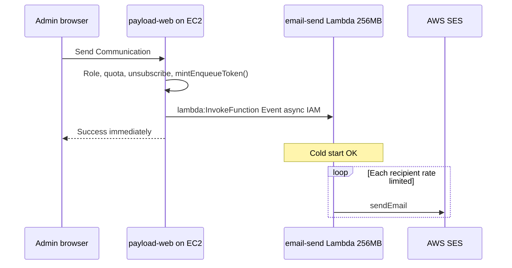

# Email service architecture

Asynchronous email delivery for BlockVibe. **Production (cost-minimized):** one **Lambda** invoked directly from **EC2 payload-web** via IAM — no API Gateway, no SQS. **Local dev:** TSOA + Express on port 4001.

Monorepo layout:

| Package / service | Path |
| ----------------- | ---- |
| Shared contracts + token crypto | `packages/email-contracts` |
| Lambda handler + local HTTP API | `services/email-service` |
| Admin UI + business rules | `apps/payload-web` |

---

## Production topology (default — lowest cost)

Cold starts are acceptable. This avoids all always-on or per-request AWS extras except Lambda compute and SES.



| Component | Used? | Why |
| --------- | ----- | --- |
| **API Gateway** | No | Saves ~$1/million requests + complexity |
| **SQS** | No | Free tier anyway; skip until Gmail needs backpressure |
| **2 Lambdas** | No | Single `invoke-handler` does verify + send |
| **Provisioned concurrency** | No | Cold starts OK |
| **Secrets Manager** | No | Use Postgres tenant fields until scale warrants SM |
| **EC2 IAM → Lambda invoke** | Yes | Only payload-web can trigger sends |

Deploy: `services/email-service/serverless.yml` → function `blockvibe-email-send` (256 MB, 300s timeout, **3-day** log retention).

### EC2 IAM (attach to instance role)

```json
{
  "Effect": "Allow",
  "Action": "lambda:InvokeFunction",
  "Resource": "arn:aws:lambda:us-east-1:ACCOUNT_ID:function:blockvibe-email-*"
}
```

### payload-web invoke (async — recommended)

```typescript
import { LambdaClient, InvokeCommand } from "@aws-sdk/client-lambda"
import { mintEnqueueToken, type DirectCampaignInvokeEvent } from "@blockvibe/email-contracts"

const token = mintEnqueueToken({ userId, role, tenantId, tenantIds })

const payload: DirectCampaignInvokeEvent = {
  token,
  tenantId: tenant.id,
  campaign: { subject, html, recipientEmails, host, tenantSlug },
}

await lambdaClient.send(
  new InvokeCommand({
    FunctionName: process.env.EMAIL_LAMBDA_FUNCTION_NAME, // blockvibe-email-dev-send
    InvocationType: "Event", // fire-and-forget; admin does not wait for 100 SMTP calls
    Payload: Buffer.from(JSON.stringify(payload)),
  })
)
```

---

## Security model (implemented)

Browsers **never** call Lambda. Only **payload-web** (server-side) after role checks.

### Layer 1 — IAM (production)

Only the EC2 instance role running payload-web has `lambda:InvokeFunction`. No public HTTP endpoint on the email Lambda.

### Layer 2 — Signed enqueue token

Short-lived HMAC token (5 min) in the invoke payload — verified inside Lambda:

```typescript
import { mintEnqueueToken } from "@blockvibe/email-contracts"

const token = mintEnqueueToken({
  userId: senderUser.id,
  role: senderUser.role, // admin | superadmin
  tenantId: tenant.id,
  tenantIds: getUserTenantIds(senderUser),
})
```

| Claim | Purpose |
| ----- | ------- |
| `sub` | Sender user id |
| `role` | `admin` or `superadmin` only |
| `tenantId` | Campaign tenant |
| `tenantIds` | Admin membership list |
| `iat` / `exp` | TTL 300s |

Lambda enforces: `admin` → `tenantId ∈ tenantIds`; `superadmin` → any tenant.

### Layer 3 — Business rules (payload-web, before invoke)

Monthly quota, unsubscribed filter, image hosting — same as today.

### Role matrix

| Role | Send? |
| ---- | ----- |
| `superadmin` | Yes — any tenant |
| `admin` | Yes — own tenant(s) |
| `editor` / `contributor` | No |

---

## Local development (TSOA + Express)

HTTP API for OpenAPI and manual testing — **not deployed to AWS** in the cost-minimized setup.

```bash
pnpm email-service:build
EMAIL_SERVICE_SIGNING_SECRET=dev-secret pnpm email-service:dev
# http://localhost:4001/health  ·  /docs
```

`POST /campaigns` with `Authorization: Bearer <token>` still works locally via `src/lambda.ts` + Express.

---

## Optional scale-up path (higher cost)

Add only when Gmail OAuth or high volume requires it:

| Upgrade | When | Extra cost |
| ------- | ---- | ---------- |
| SQS + worker Lambda | Gmail rate limits / DLQ | ~$0 + second Lambda |
| API Gateway or Function URL | Non-EC2 callers | ~$1/million |
| Secrets Manager | Many Gmail refresh tokens | $0.40/secret/mo |
| Provisioned concurrency | Sub-second latency required | **Avoid** — user accepts cold starts |

---

## Gmail OAuth (future)

OAuth in payload-web settings; store `gmailRefreshToken` on **Tenant** (Postgres, not Secrets Manager at first). Lambda worker picks SES vs Gmail; Gmail path needs **queue + rate limit** — add SQS then.

---

## Integration status

| Step | Status |
| ---- | ------ |
| `@blockvibe/email-contracts` | Done |
| `invoke-handler` (production Lambda) | Done |
| Express/TSOA (local only) | Done |
| payload-web `lambda:InvokeFunction` | **Not wired yet** |
| SES send in `processCampaignJob` | **Stub** |

---

## Environment variables

| Variable | Where | Purpose |
| -------- | ----- | ------- |
| `EMAIL_SERVICE_SIGNING_SECRET` | payload-web + Lambda | HMAC signing |
| `EMAIL_LAMBDA_FUNCTION_NAME` | payload-web | e.g. `blockvibe-email-dev-send` |
| `EMAIL_CAMPAIGN_QUEUE_URL` | Optional | Only if SQS path enabled |
| `PORT` | Local Express | Default `4001` |

---

## Monthly cost estimate (cost-minimized topology)

**Single Lambda**, **direct IAM invoke**, **SES** delivery, **3-day** CloudWatch retention, **256 MB** memory. EC2 unchanged.

### Fixed

| Component | Monthly |
| --------- | ------- |
| Lambda (idle) | **$0** |
| API Gateway | **$0** (not used) |
| SQS | **$0** (not used) |
| CloudWatch (3-day retention, low volume) | **~$0 – $0.50** |
| Secrets Manager | **$0** (Postgres for tokens) |
| **Total fixed** | **~$0 – $0.50** |

### Variable

| Component | Price | Pilot (400 emails/mo) |
| --------- | ----- | --------------------- |
| **SES** | $0.10 / 1,000 | **$0.04** |
| Lambda compute | ~256 MB × ~30–60s per broadcast | **&lt; $0.01** |
| **Total variable** | | **~$0.05** |

### Scenarios

| Scenario | Emails/mo | SES | Lambda | **Total incremental** |
| -------- | --------- | --- | ------ | --------------------- |
| Pilot | 400 | $0.04 | ~$0 | **~$0.05** |
| Small | 2,000 | $0.20 | ~$0.02 | **~$0.25** |
| Medium | 12,000 | $1.20 | ~$0.05 | **~$1.25** |
| Busy | 40,000 | $4.00 | ~$0.15 | **~$4.15** |

**At pilot scale you pay essentially SES only (~4¢/month for 400 emails).** Lambda idle cost is zero; cold starts add latency, not line-item cost.

### Cost controls

- Per-tenant monthly quota (payload-web) — already implemented
- 256 MB Lambda (not 512+)
- `logRetentionInDays: 3` in serverless.yml
- No provisioned concurrency
- Async `InvocationType: Event` so EC2 does not hold connections
- Rate limit inside `processCampaignJob` when SES send is implemented

---

## Related docs

- [CRM §7 — embedded images](../crm/implementation_plan.md#7-email-broadcaster--embedded-images)
- [Email system design](../milestones/m1/email_system_design.md)
- [services/email-service README](../../../../services/email-service/README.md)
