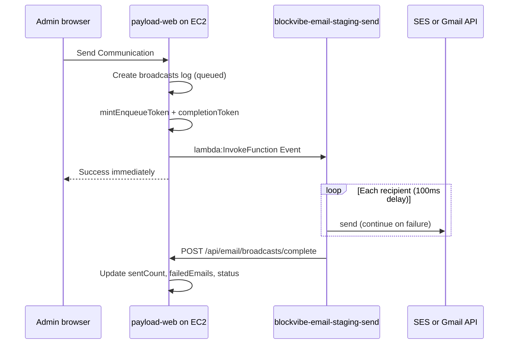

# Email service architecture

Asynchronous email delivery for BlockVibe. **Production:** one **Lambda** (`blockvibe-email-{stage}-send`) invoked directly from **EC2 payload-web** via IAM — no API Gateway, no SQS. **Local dev:** TSOA + Express on port 4001.

**Canonical docs:** [email/architecture.md](../email/architecture.md) · [email/deployment.md](../email/deployment.md)

---

## Monorepo layout

| Package / service | Path |
| ----------------- | ---- |
| Shared contracts, tokens, Gmail API | `packages/email-contracts` |
| OAuth token DB | `packages/email-srv` |
| Lambda handler + local HTTP API | `services/email-service` |
| Admin UI, OAuth, delivery log | `apps/payload-web` |

---

## Production topology



| Component | Used? | Why |
| --------- | ----- | --- |
| **API Gateway** | No | Cost + complexity |
| **SQS** | No | Optional later for backpressure |
| **EC2 IAM → Lambda** | Yes | Only payload-web can invoke |
| **Postgres from Lambda** | No | Gmail creds in signed invoke payload |

---

## Deploy (AWS CDK)

```bash
# One-time per account/region
cd services/email-service/infra && pnpm exec cdk bootstrap

# From monorepo root
pnpm email-service:deploy --staging
pnpm email-service:deploy --prod
```

Function: `blockvibe-email-{stage}-send` — 256 MB, 300s timeout, 3-day CloudWatch retention.

**Details:** [services/email-service/infra/README.md](../../../../services/email-service/infra/README.md) · [email/deployment.md](../email/deployment.md)

### EC2 env after Lambda deploy

```bash
EMAIL_LAMBDA_FUNCTION_NAME=blockvibe-email-staging-send
EMAIL_SERVICE_SIGNING_SECRET=<shared with Lambda>
AWS_REGION=us-east-1
```

Terraform grants `lambda:InvokeFunction` on `blockvibe-email-*`.

---

## Security model

Browsers **never** call Lambda.

1. **IAM** — only EC2 instance role can `lambda:InvokeFunction`
2. **Enqueue token** — 5-minute HMAC in invoke payload (`mintEnqueueToken`)
3. **Completion token** — 1-hour HMAC for delivery log callback (`mintBroadcastCompletionToken`)
4. **Business rules** — quota, role, unsubscribed filter run in payload-web before invoke

---

## Send paths in the worker

| `campaign.delivery` | Transport | Credentials |
| ------------------- | ----------- | ------------- |
| `ses` (default) | nodemailer → SES SMTP | Lambda env `SMTP_*` |
| `gmail` | Gmail API `messages.send` | `campaign.gmail.refreshToken` + `senderEmail` from invoke payload |

Gmail tokens are **not** read from Postgres in the worker. payload-web loads them from `email_srv.email_account` and embeds them in the signed campaign payload.

Per-recipient failures are collected; the worker reports `sentCount`, `failedCount`, and `failedEmails` via the completion callback.

---

## Local development

```bash
pnpm email-service:build
EMAIL_SERVICE_SIGNING_SECRET=dev-secret pnpm email-service:dev
# http://localhost:4001/health  ·  /docs
```

In `apps/payload-web/.env`:

```bash
EMAIL_SERVICE_URL=http://localhost:4001
EMAIL_SERVICE_SIGNING_SECRET=dev-secret
```

`POST /campaigns` accepts the same campaign shape as the Lambda invoke event (including `broadcastId`, `completionToken`, `gmail`).

---

## Integration status

| Step | Status |
| ---- | ------ |
| `@blockvibe/email-contracts` | Done |
| CDK deploy (`infra/`) | Done |
| `invoke-handler` (Lambda) | Done |
| Express/TSOA (local) | Done |
| payload-web `lambda:InvokeFunction` | Done (staging) |
| SES + Gmail in worker | Done |
| Delivery log callback | Done |

---

## Environment variables

| Variable | Where | Purpose |
| -------- | ----- | ------- |
| `EMAIL_SERVICE_SIGNING_SECRET` | payload-web + Lambda | Enqueue + completion HMAC |
| `EMAIL_LAMBDA_FUNCTION_NAME` | payload-web | e.g. `blockvibe-email-staging-send` |
| `AWS_REGION` | payload-web | Lambda client |
| `GOOGLE_CLIENT_ID` / `SECRET` | Lambda | Gmail token refresh |
| `SMTP_*` | Lambda | SES path |
| `PAYLOAD_SECRET` | Lambda | Unsubscribe links in HTML |
| `EMAIL_SERVICE_URL` | Local payload-web | `http://localhost:4001` |
| `PORT` | Local Express | Default `4001` |

---

## Cost (pilot scale)

Essentially **SES usage only** (~$0.04/month for 400 emails). Lambda idle cost is $0; cold starts add latency, not line-item cost. See prior cost tables in git history or [architecture.md §10](../email/architecture.md#10-limits-summary).

---

## Related docs

- [email/deployment.md](../email/deployment.md) — full deploy checklist
- [email/architecture.md](../email/architecture.md) — OAuth, data model, delivery log
- [services/email-service README](../../../../services/email-service/README.md)
