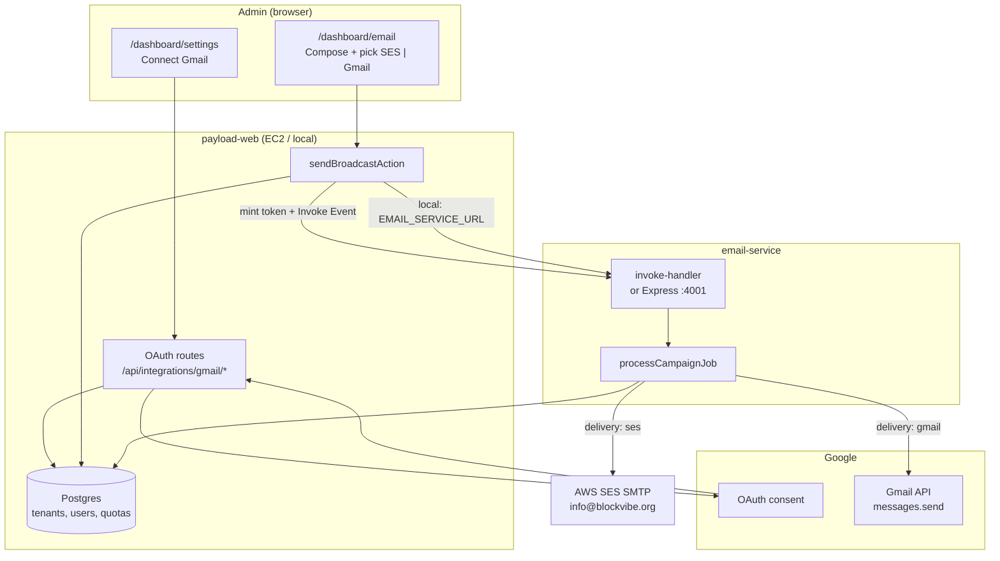
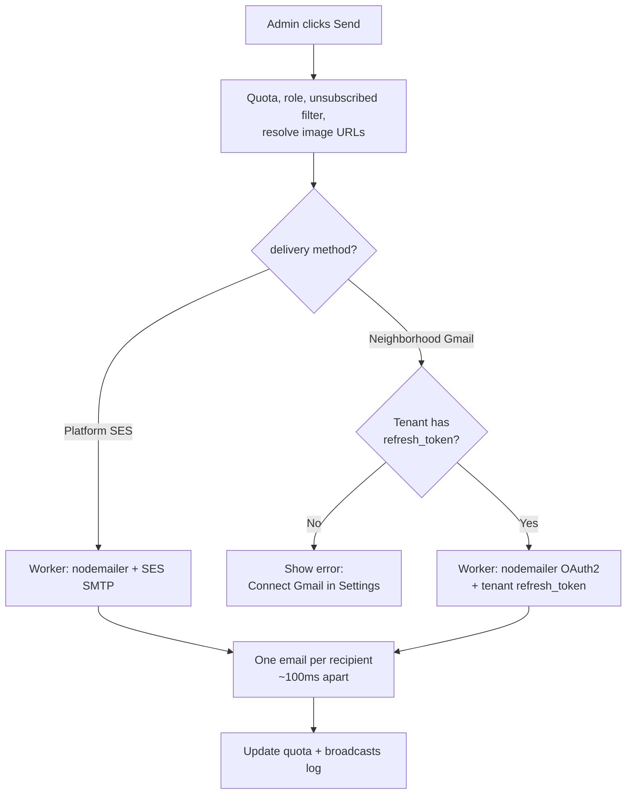
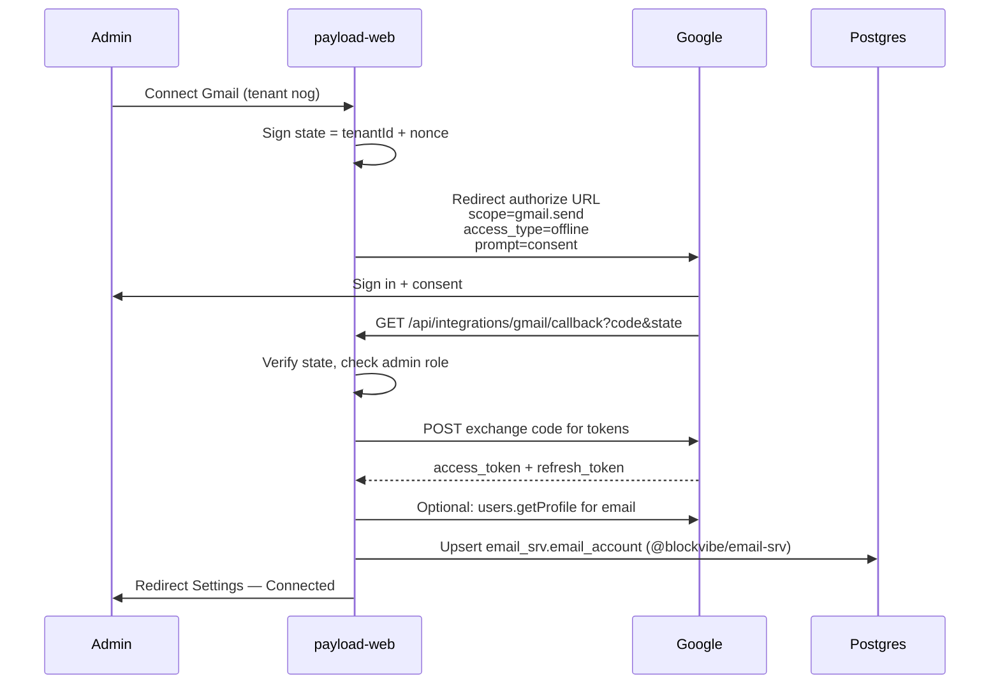
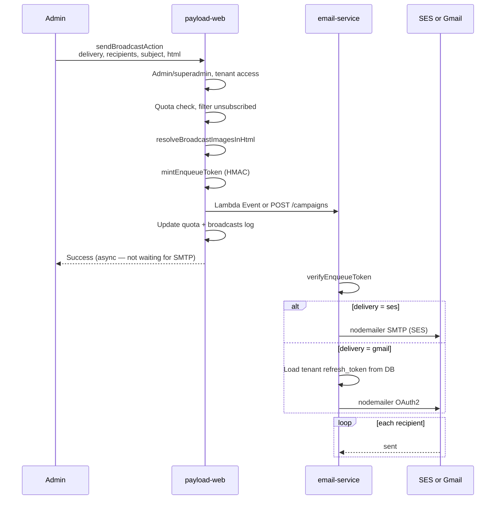

# Email delivery architecture

BlockVibe sends neighborhood broadcasts through a **dual-delivery pipeline**. Each tenant chooses (per send) whether mail goes out via the **platform SES identity** or the **tenant’s own Gmail / Google Workspace account** connected by OAuth.

This document is the canonical reference for how the pieces fit together: Google OAuth setup, Payload/Next.js, the email worker, Postgres, and compliance rules.

**Related:** [M1 email system design](../milestones/m1/email_system_design.md) (templates, sponsors, unsubscribe) · [CRM implementation plan](../crm/implementation_plan.md)

---

## 1. Goals

| Goal | Approach |
| ---- | -------- |
| Keep the Next.js server responsive | Offload bulk SMTP to a background **email worker** (Lambda in prod; Express locally) |
| Let HOAs send from their own address | **Gmail OAuth** per tenant (`president@association.org`) |
| Default for new tenants | **AWS SES** from `info@blockvibe.org` (no Google setup required) |
| Admin picks channel per broadcast | **Delivery method** selector on Email Broadcaster (SES vs Gmail) |
| Compliance | Same unsubscribe + opt-in rules regardless of transport |
| Cost | Direct Lambda invoke from EC2 — no API Gateway, no SQS |

---

## 2. High-level topology



**Production (target):** payload-web calls `lambda:InvokeFunction` with `InvocationType: "Event"` so the admin UI returns immediately while the worker sends sequentially (rate-limited).

**Local dev:** Either inline `payload.sendEmail` (no worker env vars), or `EMAIL_SERVICE_URL=http://localhost:4001` for the Express dev server.

---

## 3. Dual delivery adapters

Admins choose the transport **per broadcast**. Gmail is only available when the tenant has completed OAuth in Settings.



### Option A — Platform SES (default)

| Item | Detail |
| ---- | ------ |
| **From address** | `info@blockvibe.org` (or `SMTP_FROM_ADDRESS`) |
| **Credentials** | Shared env: `SMTP_HOST`, `SMTP_PORT`, `SMTP_USER`, `SMTP_PASS` on worker + payload fallback |
| **When to use** | Tenant has not connected Gmail, or admin explicitly chooses Platform |
| **Limits** | AWS SES account quotas (shared across all SES sends) |
| **Domain** | SPF/DKIM/DMARC on `blockvibe.org` (Terraform + SES) |

### Option B — Tenant Gmail OAuth

| Item | Detail |
| ---- | ------ |
| **From address** | Connected mailbox (e.g. `northofgrandpresident@gmail.com`) |
| **Credentials** | Per-tenant `gmailRefreshToken` in Postgres; app-level `GOOGLE_CLIENT_ID` / `GOOGLE_CLIENT_SECRET` |
| **Scope** | `https://www.googleapis.com/auth/gmail.send` |
| **When to use** | Admin chooses Neighborhood Gmail and tenant is connected |
| **Limits** | **Per connected Google account** (~500/day personal Gmail, ~2,000/day Workspace) — independent per org |
| **API cost** | Gmail API is free at BlockVibe volumes; see [Google quotas](https://developers.google.com/workspace/gmail/api/reference/quota) |

Ten orgs with ten connected Gmail accounts each have **separate** daily send budgets.

---

## 4. Google Cloud setup (one-time, platform)

One Google Cloud project serves **all tenants**. Each neighborhood connects **their own** Google account through the same OAuth client.

### 4.1 Console checklist

| Step | Where in Google Cloud | Action |
| ---- | --------------------- | ------ |
| 1 | New project | e.g. `BlockVibe-prod` |
| 2 | APIs & Services → Library | Enable **Gmail API** |
| 3 | Google Auth Platform → Branding / Audience | External app, support email, **Test users** (while in Testing) |
| 4 | Google Auth Platform → **Data Access** | **Add or remove scopes** → `https://www.googleapis.com/auth/gmail.send` (sensitive) |
| 5 | Google Auth Platform → **Clients** | Web application OAuth client |

Scopes are **not** configured on the Clients list page — use **Data Access**.

### 4.2 OAuth client URIs

**Authorized JavaScript origins** — no path, no trailing slash:

```
http://localhost:3000
https://staging.blockvibe.org
https://info.blockvibe.org
```

**Authorized redirect URIs** — full callback path:

```
http://localhost:3000/api/integrations/gmail/callback
https://staging.blockvibe.org/api/integrations/gmail/callback
https://info.blockvibe.org/api/integrations/gmail/callback
```

### 4.3 Environment variables (payload-web + worker)

```bash
GOOGLE_CLIENT_ID=...
GOOGLE_CLIENT_SECRET=...
```

Copy to `.env`, `.env.staging`, and `.env.production`. Never commit secrets.

### 4.4 Testing vs production (Google)

| Mode | Who can connect |
| ---- | ---------------- |
| **Testing** | Only emails listed under **Audience → Test users** |
| **Production** | Any user after Google **OAuth verification** for sensitive scope `gmail.send` |

---

## 5. Gmail OAuth connect flow (per tenant)

Implemented in payload-web; tenant admin uses **Dashboard → Settings**.

### 5.1 Settings UI (in-app guidance)

The Settings page is the primary surface for OAuth — admins should not need Google Cloud Console docs for day-to-day use.

**Before connect**

- Short copy: send from the neighborhood Gmail instead of `info@blockvibe.org`
- **Connect Gmail** → starts OAuth (`/api/integrations/gmail/connect`)
- Collapsible **Setup & troubleshooting** (admin / superadmin):
  - Reminder: app in **Testing** mode → only **Audience → Test users** can authorize
  - Read-only **callback URL** derived from `NEXT_PUBLIC_SERVER_URL`:

    ```
    {NEXT_PUBLIC_SERVER_URL}/api/integrations/gmail/callback
    ```

  - Checklist: Gmail API enabled, `gmail.send` in Data Access, redirect URI matches callback URL

**After connect**

- Status: Connected as `{gmailSenderEmail}` since `{gmailConnectedAt}`
- **Disconnect** (clears tokens on tenant)
- **Default delivery** radio: Platform (SES) / Neighborhood Gmail
- Link to Email Broadcaster

**Callback errors** (redirect to `/{tenant}/dashboard/settings?gmail=error&code=…`)

| `code` | User-facing message |
| ------ | ------------------- |
| `access_denied` | Authorization cancelled |
| `not_test_user` | Gmail not listed as Google test user (Testing mode) |
| `redirect_mismatch` | Callback URL mismatch — show expected URL in UI |
| `missing_refresh_token` | Re-connect with `prompt=consent` |
| `unauthorized` | Not an admin for this neighborhood |



**OAuth parameters:**

| Parameter | Value |
| --------- | ----- |
| `scope` | `https://www.googleapis.com/auth/gmail.send` |
| `access_type` | `offline` (required for `refresh_token`) |
| `prompt` | `consent` on first connect (ensures refresh token) |
| `state` | HMAC-signed `tenantId` (CSRF) |

**Disconnect:** Clear token fields on tenant; optional Google token revoke.

---

## 6. Broadcast send flow



**Campaign payload** (extends `@blockvibe/email-contracts`):

```typescript
{
  subject: string
  html: string
  recipientEmails: string[]
  host: string
  tenantSlug: string
  delivery: "ses" | "gmail"   // new
  tenantId: number            // required for gmail path
}
```

---

## 7. Data model

One shared **Postgres** instance, two logical layers:

| Layer | Schema / owner | Contents |
| ----- | -------------- | -------- |
| **CMS** | `public` (Payload) | tenants, users, broadcasts, quotas, content |
| **Email service** | `email_srv` (`@blockvibe/email-srv`) | OAuth tokens, delivery credentials |

payload-web uses **Payload** for CMS data and **`@blockvibe/email-srv`** for email credentials — no Payload collection for refresh tokens.

### 7.1 `email_srv.email_account` (not CMS)

Package: `packages/email-srv` · Table: **`email_srv.email_account`**

| Column | Purpose |
| ------ | ------- |
| `tenant_id` (unique) | Logical link to CMS tenant (no ORM coupling) |
| `provider` | `gmail` (extensible) |
| `sender_email` | From address |
| `refresh_token` | OAuth secret |
| `connected_at` | Last connect time |
| `connected_by_user_id` | Admin who authorized |

Schema is managed with **Drizzle** (`packages/email-srv`). Run migrations before deploy or local dev:

```bash
pnpm --filter @blockvibe/email-srv db:migrate
```

Generate new migrations after schema changes: `pnpm --filter @blockvibe/email-srv db:generate`

**Code layout**

```
packages/email-srv/          # No Payload dependency
  src/
    client/                # Pool + Drizzle client
    schema/                # Drizzle schema (email_srv)
    repositories/          # email-account queries
    migrations/            # runEmailSrvMigrations()
    types/
  scripts/migrate.ts       # CLI entry for db:migrate
  drizzle/                 # SQL migrations

apps/payload-web/
  src/utilities/emailSrvAccount.ts   # Thin adapter for dashboard routes
  src/app/api/integrations/gmail/    # OAuth (writes via email-srv)

services/email-service/        # Future: reads credentials from invoke payload only
```

### 7.2 `tenants` (CMS only)

| Field | Purpose |
| ----- | ------- |
| `emailDeliveryDefault` | `ses` \| `gmail` — UI preference only |

### 7.3 Other CMS collections

| Collection | Role in email |
| ---------- | ------------- |
| `users` | Recipients; `unsubscribed`, `status === approved'` |
| `tenant-email-quotas` | 500 emails/month per tenant (app limit) |
| `broadcasts` | Sent log (subject, html, recipients) |

### 7.4 Auth between payload-web and worker

Short-lived HMAC **enqueue token** (`EMAIL_SERVICE_SIGNING_SECRET`), same pattern as API Bearer auth locally.

| Env (payload-web) | Purpose |
| ----------------- | ------- |
| `EMAIL_SERVICE_SIGNING_SECRET` | Mint/verify enqueue tokens |
| `EMAIL_LAMBDA_FUNCTION_NAME` | Prod: async invoke |
| `EMAIL_SERVICE_URL` | Local: `http://localhost:4001` |
| `AWS_REGION` | Lambda client region |

| Env (worker) | Purpose |
| ------------ | ------- |
| `EMAIL_SERVICE_SIGNING_SECRET` | Verify tokens |
| `SMTP_*` | SES transport |
| `GOOGLE_CLIENT_ID` / `GOOGLE_CLIENT_SECRET` | Gmail OAuth refresh |
| `PAYLOAD_SECRET` | Unsubscribe HMAC in HTML |

**Lambda does not connect to Postgres.** payload-web reads `email_srv.email_account` via `@blockvibe/email-srv` and passes Gmail credentials inside the **signed invoke payload** (see §6).

---

## 8. Email worker deployment

Cost-minimized production topology (see `services/email-service` on branch `feat/email-service-lambda`):

```
EC2 payload-web  --IAM lambda:InvokeFunction-->  blockvibe-email-{stage}-send
                                                      |
                                                      +--> SES SMTP
                                                      +--> Gmail API (OAuth)
```

| Component | Prod | Local |
| --------- | ---- | ----- |
| Entry | `invoke-handler.ts` | `server.ts` (Express + TSOA) |
| Deploy | `serverless deploy` (no API Gateway) | `pnpm email-service:dev` |
| EC2 IAM | `lambda:InvokeFunction` on `blockvibe-email-*` | N/A |

---

## 9. Compliance (both transports)

Rules are **identical** for SES and Gmail. See [email_system_design.md §6](../milestones/m1/email_system_design.md#6-email-transport-adapters-dual-delivery-pipeline).

| Rule | Implementation |
| ---- | -------------- |
| Opt-in | Only `approved` users; broadcasts filter `unsubscribed !== true` |
| Footer unsubscribe | HMAC link via `PAYLOAD_SECRET` + `buildBroadcastEmailHtml` |
| List-Unsubscribe headers | Planned on worker send (RFC 8058) |
| Monthly cap | `tenant-email-quotas` (500/month default) |
| Bounces | SES: SNS webhooks (planned). Gmail: tenant inbox / Pub/Sub (planned) |

---

## 10. Limits summary

| Limit | Scope | Typical value |
| ----- | ----- | ------------- |
| BlockVibe monthly quota | Per tenant | 500 emails/month |
| Gmail send cap | Per connected Google account | ~500/day (personal) or ~2,000/day (Workspace) |
| SES | Per AWS account / verified identity | Account-specific |
| Worker rate limit | Per campaign | ~10 emails/sec (100ms delay) |
| Broadcaster UI | Per send | 100 residents selected |

---

## 11. Implementation status

| Piece | Status |
| ----- | ------ |
| Email Broadcaster UI + SES inline send | **Shipped** (main) |
| Image upload / hosted URLs in HTML | **Shipped** |
| Email microservice + Lambda invoke | **Branch** `feat/email-service-lambda` |
| Google OAuth client + env vars | **Done** (your setup) |
| Tenant Gmail fields | **Shipped** — `email_srv.email_account` via `@blockvibe/email-srv` |
| OAuth connect/callback routes | **Shipped** |
| Settings → Connect Gmail UI | **Shipped** |
| Broadcaster delivery selector | **Shipped** |
| Worker Gmail transporter + DB token load | **Planned** (email-service branch; inline Gmail send works on main path) |

**Suggested build order:**

1. Tenant schema fields  
2. OAuth routes + Settings UI  
3. Test connect locally (test user in Google Audience)  
4. Delivery picker on broadcaster  
5. Worker: `delivery` flag + Gmail nodemailer transport  
6. Merge email-service branch + deploy Lambda  

---

## 12. Local verification checklist

After implementation:

1. `GOOGLE_CLIENT_*` in `.env`; Gmail API enabled; `gmail.send` in Data Access  
2. Your Gmail listed as **Test user** in Google Audience  
3. `pnpm dev` (payload-web) + `pnpm email-service:dev` (optional)  
4. NOG admin → Settings → Connect Gmail  
5. Email Broadcaster → choose **Gmail** → send test to yourself  
6. Confirm **From** is the connected Gmail address (Mailpit locally, inbox in prod)

---

## 13. Security notes

- Store `GOOGLE_CLIENT_SECRET` and `refresh_token` (in `email_srv.email_account`) only in env / DB — never in git  
- OAuth `state` must be signed and tenant-scoped  
- Only `admin` / `superadmin` for tenant may connect Gmail or send broadcasts  
- Rotate secrets if exposed in chat or logs  
- Worker loads refresh tokens only when `delivery === "gmail"` and `tenantId` matches token claims
