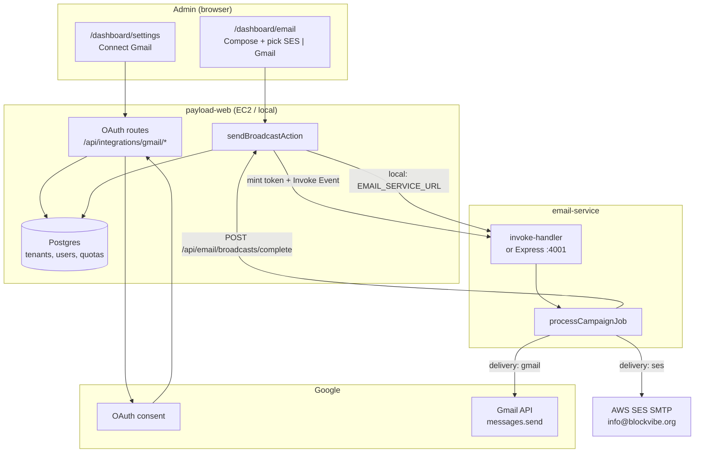
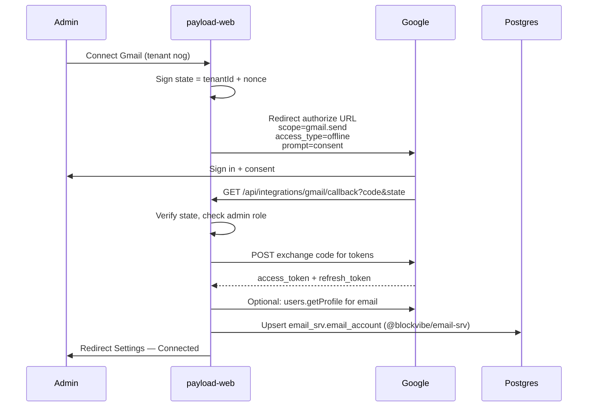
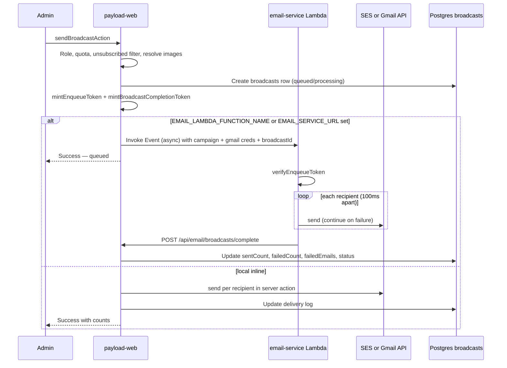

# Email delivery architecture

BlockVibe sends neighborhood broadcasts through a **dual-delivery pipeline**. Each tenant chooses (per send) whether mail goes out via the **platform SES identity** or the **tenant’s own Gmail / Google Workspace account** connected by OAuth.

This document is the canonical reference for how the pieces fit together: Google OAuth setup, Payload/Next.js, the email worker, Postgres, and compliance rules.

**Related:** [M1 email system design](../milestones/m1/email_system_design.md) (templates, sponsors, unsubscribe) · [CRM implementation plan](../crm/implementation_plan.md)

---

## 1. Goals

| Goal | Approach |
| ---- | -------- |
| Keep the Next.js server responsive | Offload bulk SMTP to a background **email worker** (Lambda in prod; Express locally) |
| Let HOAs send from their own address | **Gmail OAuth** per tenant (`president@association.org`) |
| Default for new tenants | **AWS SES** from `info@blockvibe.org` (no Google setup required) |
| Admin picks channel per broadcast | **Delivery method** selector on Email Broadcaster (SES vs Gmail) |
| Compliance | Same unsubscribe + opt-in rules regardless of transport |
| Cost | Direct Lambda invoke from EC2 — no API Gateway, no SQS |

---

## 2. High-level topology



**Staging / production:** When `EMAIL_LAMBDA_FUNCTION_NAME` is set, both SES and Gmail sends run in the **worker** (async). payload-web returns immediately; the worker updates the delivery log via a signed completion callback.

**Local dev:** Without worker env vars, sends run **inline** in `sendBroadcastAction` (same delivery log fields, synchronous).

---

## 3. Dual delivery adapters

Admins choose the transport **per broadcast**. Gmail is only available when the tenant has completed OAuth in Settings.

```mermaid
flowchart TD
    Start[Admin clicks Send] --> Validate[Quota, role, unsubscribed filter,\nresolve image URLs]
    Validate --> Pick{delivery method?}

    Pick -->|Platform SES| SESPath[Worker: nodemailer + SES SMTP]
    Pick -->|Neighborhood Gmail| GmailCheck{Tenant has\nrefresh_token?}

    GmailCheck -->|No| Error[Show error:\nConnect Gmail in Settings]
    GmailCheck -->|Yes| GmailPath[Gmail API via worker or inline]

    SESPath --> CreateLog[Create broadcasts row\nstatus=queued|processing]
    GmailPath --> CreateLog
    CreateLog --> Send{Worker configured?}

    Send -->|Yes| Async[Lambda Event invoke\nreturn UI immediately]
    Send -->|No| Inline[Send in server action\nupdate log when done]

    Async --> WorkerSend[Worker: per-recipient send\n100ms delay, collect failures]
    Inline --> WorkerSend
    WorkerSend --> Complete[Update broadcasts:\nsentCount, failedCount,\nfailedEmails, status]
```

### Option A — Platform SES (default)

| Item | Detail |
| ---- | ------ |
| **From address** | `info@blockvibe.org` (or `SMTP_FROM_ADDRESS`) |
| **Credentials** | Shared env: `SMTP_HOST`, `SMTP_PORT`, `SMTP_USER`, `SMTP_PASS` on worker + payload fallback |
| **When to use** | Tenant has not connected Gmail, or admin explicitly chooses Platform |
| **Limits** | AWS SES account quotas (shared across all SES sends) |
| **Domain** | SPF/DKIM/DMARC on `blockvibe.org` (Terraform + SES) |

### Option B — Tenant Gmail OAuth

| Item | Detail |
| ---- | ------ |
| **From address** | Connected mailbox (e.g. `northofgrandpresident@gmail.com`) |
| **Credentials** | Per-tenant `refresh_token` in `email_srv.email_account`; passed to worker in signed invoke payload |
| **Transport** | **Gmail API** `messages.send` (not SMTP — `gmail.send` scope does not support SMTP auth) |
| **Scope** | `gmail.send` + `userinfo.email` + `gmail.labels` (send, read address, optional Sent-folder control) |
| **When to use** | Admin chooses Neighborhood Gmail and tenant is connected |
| **Limits** | **Per connected Google account** (~500/day personal Gmail, ~2,000/day Workspace) — independent per org |
| **API cost** | Gmail API is free at BlockVibe volumes; see [Google quotas](https://developers.google.com/workspace/gmail/api/reference/quota) |

Ten orgs with ten connected Gmail accounts each have **separate** daily send budgets.

---

## 4. Google Cloud setup (one-time, platform)

One Google Cloud project serves **all tenants**. Each neighborhood connects **their own** Google account through the same OAuth client.

### 4.1 Console checklist

| Step | Where in Google Cloud | Action |
| ---- | --------------------- | ------ |
| 1 | New project | e.g. `BlockVibe-prod` |
| 2 | APIs & Services → Library | Enable **Gmail API** |
| 3 | Google Auth Platform → Branding / Audience | External app, support email, **Test users** (while in Testing) |
| 4 | Google Auth Platform → **Data Access** | Add `gmail.send` (sensitive), `userinfo.email`, and `gmail.labels` (for optional “skip Sent folder”) |
| 5 | Google Auth Platform → **Clients** | Web application OAuth client |

Scopes are **not** configured on the Clients list page — use **Data Access**.

### 4.2 OAuth client URIs

**Authorized JavaScript origins** — no path, no trailing slash:

```
http://localhost:3000
https://staging.blockvibe.org
https://info.blockvibe.org
```

**Authorized redirect URIs** — full callback path:

```
http://localhost:3000/api/integrations/gmail/callback
https://staging.blockvibe.org/api/integrations/gmail/callback
https://info.blockvibe.org/api/integrations/gmail/callback
```

### 4.3 Environment variables (payload-web + worker)

```bash
GOOGLE_CLIENT_ID=...
GOOGLE_CLIENT_SECRET=...
```

Copy to `.env`, `.env.staging`, and `.env.production`. Never commit secrets.

### 4.4 Testing vs production (Google)

| Mode | Who can connect |
| ---- | ---------------- |
| **Testing** | Only emails listed under **Audience → Test users** |
| **Production** | Any user after Google **OAuth verification** for sensitive scope `gmail.send` |

---

## 5. Gmail OAuth connect flow (per tenant)

Implemented in payload-web; tenant admin uses **Dashboard → Settings**.

### 5.1 Settings UI (in-app guidance)

The Settings page is the primary surface for OAuth — admins should not need Google Cloud Console docs for day-to-day use.

**Before connect**

- Short copy: send from the neighborhood Gmail instead of `info@blockvibe.org`
- **Connect Gmail** → starts OAuth (`/api/integrations/gmail/connect`)
- Collapsible **Setup & troubleshooting** (admin / superadmin):
  - Reminder: app in **Testing** mode → only **Audience → Test users** can authorize
  - Read-only **callback URL** derived from `NEXT_PUBLIC_SERVER_URL`:

    ```
    {NEXT_PUBLIC_SERVER_URL}/api/integrations/gmail/callback
    ```

  - Checklist: Gmail API enabled, `gmail.send` in Data Access, redirect URI matches callback URL

**After connect**

- Status: Connected as `{gmailSenderEmail}` since `{gmailConnectedAt}`
- **Disconnect** (clears tokens on tenant)
- **Default delivery** radio: Platform (SES) / Neighborhood Gmail
- Link to Email Broadcaster

**Callback errors** (redirect to `/{tenant}/dashboard/settings?gmail=error&code=…`)

| `code` | User-facing message |
| ------ | ------------------- |
| `access_denied` | Authorization cancelled |
| `not_test_user` | Gmail not listed as Google test user (Testing mode) |
| `redirect_mismatch` | Callback URL mismatch — show expected URL in UI |
| `missing_refresh_token` | Re-connect with `prompt=consent` |
| `unauthorized` | Not an admin for this neighborhood |



**OAuth parameters:**

| Parameter | Value |
| --------- | ----- |
| `scope` | `gmail.send` `userinfo.email` |
| `access_type` | `offline` (required for `refresh_token`) |
| `prompt` | `consent` on first connect (ensures refresh token) |
| `state` | HMAC-signed `tenantId` (CSRF) |

**Disconnect:** Clear token fields on tenant; optional Google token revoke.

---

## 6. Broadcast send flow



**Campaign payload** (`@blockvibe/email-contracts` `EnqueueCampaignRequest`):

```typescript
{
  subject: string
  html: string
  recipientEmails: string[]
  host: string              // tenant host for unsubscribe links + worker callback URL
  tenantSlug: string
  delivery?: "ses" | "gmail"
  broadcastId?: number      // CMS log row to update
  gmail?: {                 // required when delivery === "gmail"
    refreshToken: string
    senderEmail: string
    skipSentFolder?: boolean
  }
}
```

**Direct Lambda invoke** also includes `completionToken` (HMAC, 1h TTL) for the worker callback.

Per-recipient failures are **collected** (send continues). Status is `completed`, `partial`, or `failed` based on counts.

---

## 7. Data model

One shared **Postgres** instance, two logical layers:

| Layer | Schema / owner | Contents |
| ----- | -------------- | -------- |
| **CMS** | `public` (Payload) | tenants, users, broadcasts, quotas, content |
| **Email service** | `email_srv` (`@blockvibe/email-srv`) | OAuth tokens, delivery credentials |

payload-web uses **Payload** for CMS data and **`@blockvibe/email-srv`** for email credentials — no Payload collection for refresh tokens.

### 7.1 `email_srv.email_account` (not CMS)

Package: `packages/email-srv` · Table: **`email_srv.email_account`**

| Column | Purpose |
| ------ | ------- |
| `tenant_id` (unique) | Logical link to CMS tenant (no ORM coupling) |
| `provider` | `gmail` (extensible) |
| `sender_email` | From address |
| `refresh_token` | OAuth secret |
| `connected_at` | Last connect time |
| `connected_by_user_id` | Admin who authorized |

Schema is managed with **Drizzle** (`packages/email-srv`). See **[packages/email-srv/README.md](../../../../packages/email-srv/README.md)** for local, staging, and production migration steps.

Quick local run:

```bash
pnpm --filter @blockvibe/email-srv db:migrate
```

Generate new migrations after schema changes: `pnpm --filter @blockvibe/email-srv db:generate`

**Code layout**

```
packages/email-srv/          # No Payload dependency
  src/
    client/                # Pool + Drizzle client
    schema/                # Drizzle schema (email_srv)
    repositories/          # email-account queries
    migrations/            # runEmailSrvMigrations()
    types/
  scripts/migrate.ts       # CLI entry for db:migrate
  drizzle/                 # SQL migrations

apps/payload-web/
  src/utilities/emailSrvAccount.ts   # Thin adapter for dashboard routes
  src/app/api/integrations/gmail/    # OAuth (writes via email-srv)

services/email-service/        # Lambda worker — no Postgres; Gmail creds from invoke payload
```

### 7.3 Broadcasts (delivery log)

Collection: `broadcasts` (tenant-scoped via multi-tenant plugin). Shown on **Dashboard → Email** as **Delivery log** (last 20 per neighborhood).

| Field | Type | Purpose |
| ----- | ---- | ------- |
| `subject` | text | Broadcast subject |
| `message` | textarea | Resolved HTML body |
| `recipients` | json | Target email addresses |
| `delivery` | select | `ses` \| `gmail` |
| `status` | select | `queued` \| `processing` \| `completed` \| `partial` \| `failed` |
| `sentCount` | number | Successful deliveries |
| `failedCount` | number | Failed deliveries |
| `failedEmails` | json | **Array of failing addresses** |
| `jobId` | text | Worker job UUID (async sends) |
| `sender` | relationship | User who sent |

**Status rules** (`resolveBroadcastDeliveryStatus` in `@blockvibe/email-contracts`):

| Condition | Status |
| --------- | ------ |
| `sentCount === 0` and `failedCount > 0` | `failed` |
| `failedCount > 0` | `partial` |
| otherwise | `completed` |

**Worker callback:** `POST /api/email/broadcasts/complete` with `Authorization: Bearer <completionToken>`. Token is minted at send time and binds `broadcastId` + `tenantId`. Updates use `overrideAccess: true` (collection `update` access is false for immutability).

### 7.4 Other CMS collections

Short-lived HMAC **enqueue token** (`EMAIL_SERVICE_SIGNING_SECRET`), same pattern as API Bearer auth locally.

| Env (payload-web) | Purpose |
| ----------------- | ------- |
| `EMAIL_SERVICE_SIGNING_SECRET` | Mint/verify enqueue tokens |
| `EMAIL_LAMBDA_FUNCTION_NAME` | Prod: async invoke |
| `EMAIL_SERVICE_URL` | Local: `http://localhost:4001` |
| `AWS_REGION` | Lambda client region |

| Env (worker) | Purpose |
| ------------ | ------- |
| `EMAIL_SERVICE_SIGNING_SECRET` | Verify tokens |
| `SMTP_*` | SES transport |
| `GOOGLE_CLIENT_ID` / `GOOGLE_CLIENT_SECRET` | Gmail OAuth refresh |
| `PAYLOAD_SECRET` | Unsubscribe HMAC in HTML; fallback for completion signing |

**Lambda does not connect to Postgres.** payload-web reads `email_srv.email_account` and passes Gmail `refreshToken` + `senderEmail` in the signed invoke payload.

### 7.5 `tenants` (CMS only)

| Field | Purpose |
| ----- | ------- |
| `emailDeliveryDefault` | `ses` \| `gmail` — Broadcaster default |

### 7.6 Other CMS collections (recipients & quotas)

| Collection | Role in email |
| ---------- | ------------- |
| `users` | Recipients; `unsubscribed`, `status === approved` |
| `tenant-email-quotas` | 500 emails/month per tenant (app limit) |

### 7.7 Auth between payload-web and worker

---

## 8. Email worker deployment (AWS CDK)

```
EC2 payload-web  --IAM lambda:InvokeFunction-->  blockvibe-email-{stage}-send
                                                      |
                                                      +--> SES SMTP (nodemailer)
                                                      +--> Gmail API (OAuth refresh in payload)
                                                      +--> POST callback → payload-web delivery log
```

| Component | Staging / prod | Local |
| --------- | -------------- | ----- |
| Entry | `invoke-handler.ts` | `server.ts` (Express + TSOA, :4001) |
| Deploy | `pnpm email-service:deploy --staging\|--prod` | `pnpm email-service:dev` |
| Bundle | esbuild → `dist/lambda/invoke-handler.js` | tsc |
| IaC | `services/email-service/infra/` (AWS CDK) | N/A |
| Function name | `blockvibe-email-staging-send` / `blockvibe-email-prod-send` | N/A |

**Full deploy steps:** [deployment.md](./deployment.md)

`serverless.yml` is deprecated; use CDK.

---

## 9. Compliance (both transports)

Rules are **identical** for SES and Gmail. See [email_system_design.md §6](../milestones/m1/email_system_design.md#6-email-transport-adapters-dual-delivery-pipeline).

| Rule | Implementation |
| ---- | -------------- |
| Opt-in | Only `approved` users; broadcasts filter `unsubscribed !== true` |
| Footer unsubscribe | HMAC link via `PAYLOAD_SECRET` + `buildBroadcastEmailHtml` |
| List-Unsubscribe headers | Planned on worker send (RFC 8058) |
| Monthly cap | `tenant-email-quotas` (500/month default) |
| Bounces | SES: SNS webhooks (planned). Gmail: tenant inbox / Pub/Sub (planned) |

---

## 10. Limits summary

| Limit | Scope | Typical value |
| ----- | ----- | ------------- |
| BlockVibe monthly quota | Per tenant | 500 emails/month |
| Gmail send cap | Per connected Google account | ~500/day (personal) or ~2,000/day (Workspace) |
| SES | Per AWS account / verified identity | Account-specific |
| Worker rate limit | Per campaign | ~10 emails/sec (100ms delay) |
| Broadcaster UI | Per send | 100 residents selected |

---

## 11. Implementation status

| Piece | Status |
| ----- | ------ |
| Email Broadcaster UI | **Shipped** |
| Dual delivery (SES / Gmail) selector | **Shipped** |
| Gmail OAuth connect + `email_srv` tokens | **Shipped** |
| Gmail API send (not SMTP) | **Shipped** |
| Async worker (Lambda CDK) — SES + Gmail | **Shipped** (staging) |
| Delivery log per tenant (`broadcasts`) | **Shipped** |
| Per-recipient failure tracking + `failedEmails` JSON | **Shipped** |
| Worker completion callback | **Shipped** |
| Optional “skip Gmail Sent folder” | **Shipped** |
| List-Unsubscribe headers on worker | Planned |
| SES bounce webhooks | Planned |

---

## 12. Local verification checklist

1. `GOOGLE_CLIENT_*` in `.env`; Gmail API enabled; scopes in Data Access  
2. `pnpm --filter @blockvibe/email-srv db:migrate`  
3. Your Gmail as **Test user** (if Google app in Testing mode)  
4. `pnpm --filter payload-web dev`  
5. Optional worker: `EMAIL_SERVICE_URL=http://localhost:4001` + `pnpm email-service:dev`  
6. Settings → Connect Gmail  
7. Broadcaster → send → verify **Delivery log** (sent/failed counts, failed addresses)  
8. Staging: deploy Lambda + payload-web per [deployment.md](./deployment.md)

---

## 13. Security notes

- Store `GOOGLE_CLIENT_SECRET` and `refresh_token` (in `email_srv.email_account`) only in env / DB — never in git  
- OAuth `state` must be signed and tenant-scoped  
- Only `admin` / `superadmin` for tenant may connect Gmail or send broadcasts  
- Rotate secrets if exposed in chat or logs  
- Worker loads refresh tokens only when `delivery === "gmail"` and `tenantId` matches token claims
