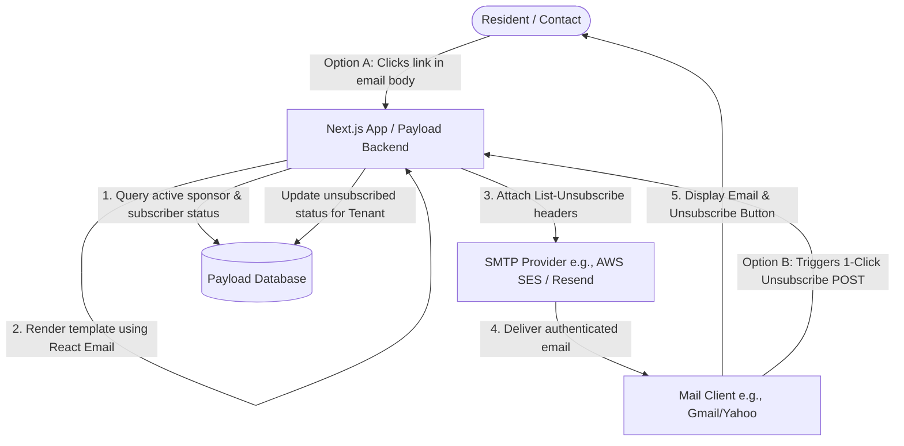
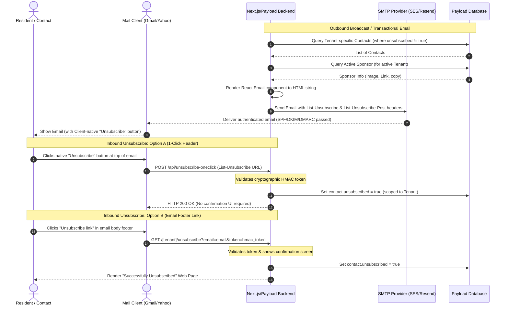
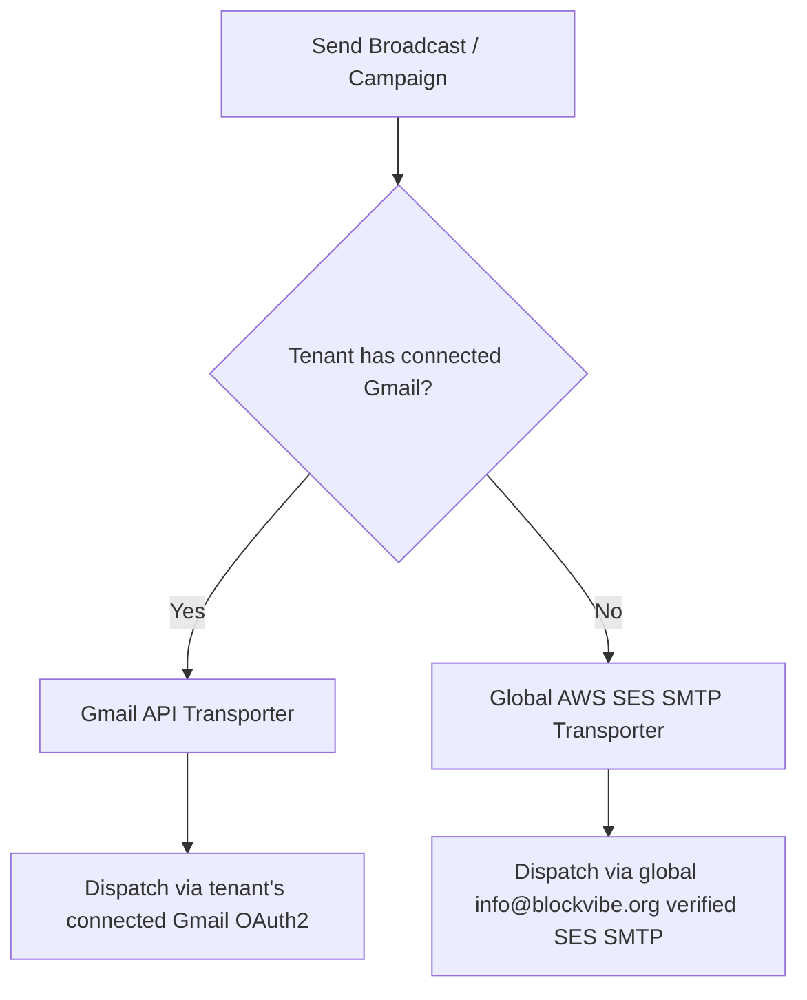

# Email System Design (Option A: Payload + React Email)

This document details the architectural design for the multi-tenant email broadcast and transactional system in BlockVibe. The system is designed to be fully self-contained within Payload CMS/Next.js, support custom HTML email templates (via React Email), inject dynamic sponsor blocks, and strictly comply with the Google/Yahoo bulk sender requirements (SPF, DKIM, DMARC, and RFC 8058 1-Click Unsubscribe).

---

## 1. System Architecture

The following diagram illustrates the relationship between Payload CMS/Next.js, the database collections, the SMTP provider (e.g., AWS SES or Resend), and the mail clients (e.g., Gmail, Yahoo Mail) for both outbound delivery and inbound unsubscribe actions:



### Detailed Sequence Diagram (Outbound & Inbound)

This sequence diagram details the runtime steps for composing/sending emails and handling secure, compliant opt-out requests:



---

## 2. Database Collections Design

To support multitenant subscriptions, tenant plans, and dynamic sponsorships, we will define or extend three collections in Payload CMS.

### Collection 1: `Sponsors` (New Collection)
Sponsors are scoped either to specific tenants (for neighborhood-level sponsors) or to the platform itself (for global BlockVibe platform sponsors on the sponsored tier).

* **File:** `src/collections/Sponsors.ts`
* **Fields:**
  * `name` (Text, Required) - Internal name for the sponsor.
  * `active` (Checkbox, Default: `true`) - Toggles if this sponsor is eligible for email placement.
  * `imageUrl` (Upload to `media`, Required) - The promotional banner/logo image.
  * `linkUrl` (Text, Required) - Destination link when clicked.
  * `text` (Text, Optional) - Short description or call-to-action copy.
  * `weight` (Number, Default: `1`) - Used for randomized/weighted rotation if multiple sponsors are active.
  * `tenant` (Relationship to `tenants`, Optional) - If left empty (`null`), this is treated as a **global BlockVibe platform sponsor** injected across all sponsored-tier tenants. If filled, it is scoped to that specific neighborhood.

### Collection 2: `Contacts` (Extended Fields)
To implement secure 1-click unsubscribes and maintain compliance without database bloat, we extend the planned `contacts` schema:

* **File:** `src/collections/Contacts.ts`
* **Fields:**
  * `email` (Email, Required, Unique within tenant)
  * `unsubscribed` (Checkbox, Default: `false`) - Checked when the user globally opts out of this tenant's mailing list.
  * `unsubscribeToken` (Text, Hidden) - A unique, random secret token generated upon contact creation. Used to construct secure unsubscribe links.
  * `tenant` (Relationship to `tenants`) - Scopes the contact to a specific neighborhood.

### Collection 3: `Tenants` (Extended Fields)
To track which email sponsorship model applies to a given neighborhood, we add a plan/tier field:

* **File:** `src/collections/Tenants/index.ts`
* **Fields:**
  * `emailTier` (Select, Default: `'sponsored'`) - Dictates the advertisement rules:
    * `sponsored`: BlockVibe automatically injects a global platform sponsor from our platform-wide pool.
    * `custom-sponsors`: The neighborhood has upgraded and can manage and display their own local sponsors.
    * `ad-free`: The neighborhood is on a premium plan; no sponsor messages or ads are injected.

---

## 3. Template Design & Sponsor Injection (React Email)

Instead of hand-crafting complex HTML strings that break in Outlook or Gmail, we use **React Email** components.

### Structure of `src/emails/BroadcastTemplate.tsx`
A base React component wraps all broadcasts. It will conditionally inject the appropriate sponsor banner and dynamic unsubscribe links:

1. **Header Section:** Dynamic logo of the active neighborhood tenant.
2. **Body Section:** HTML content from the tenant **Email Broadcaster** composer ([`RichTextEditor`](../../src/components/RichTextEditor.tsx)). Embedded images are uploaded to tenant **Media** when inserted and referenced by public HTTPS URLs (not inline base64), so Gmail and other clients can load them. See [CRM implementation plan §7 — embedded images](../crm/implementation_plan.md#7-email-broadcaster--embedded-images).
3. **Sponsor Section (Conditional Resolution):**
   * **If `tenant.emailTier === 'sponsored'`:** Query active sponsors where `tenant` relation is empty (null). Randomly/weighted select a global BlockVibe sponsor and inject the banner at the bottom of the email.
   * **If `tenant.emailTier === 'custom-sponsors'`:** Query active sponsors scoped to that specific `tenant`. Select one and inject their neighborhood sponsor banner.
   * **If `tenant.emailTier === 'ad-free'`:** Skip the sponsor section entirely.
4. **Footer Section:** 
   * A clear message explaining why they received the email.
   * A standard `<a href="...">Unsubscribe</a>` link containing the secure token.

---

## 4. Compliance & Header Implementation (RFC 8058)

To comply with the strict Google/Yahoo requirements, every outgoing email sent via Nodemailer/AWS SES must carry specific headers.

### SMTP Headers Configuration
When dispatching the mail payload through our server actions, we will inject:

```typescript
const headers = {
  // Tells mail clients that we support 1-Click unsubscribe via POST
  'List-Unsubscribe-Post': 'List-Unsubscribe=One-Click',
  
  // The unique URL for client-native unsubscribe buttons
  'List-Unsubscribe': `<https://${tenantDomain}/api/unsubscribe-oneclick?token=${contact.unsubscribeToken}>`
}
```

### Unsubscribe Route Handlers
We will implement two distinct endpoints in Next.js:

1. **Native Client Unsubscribe (POST `/api/unsubscribe-oneclick`):**
   * **Behavior:** Triggered automatically by Gmail/Yahoo in the background when a user clicks their inbox "Unsubscribe" header.
   * **Payload:** Contains `List-Unsubscribe=One-Click` in the POST body.
   * **Action:** Validates the query parameter `token`, finds the matching contact, sets `unsubscribed: true`, and returns HTTP `200 OK`. No web page is rendered.
   
2. **User Unsubscribe Webpage (GET `/[tenant]/unsubscribe`):**
   * **Behavior:** Triggered when the user clicks the footer link inside the email.
   * **Action:** Validates the `token` parameter, updates the contact's subscription status to `unsubscribed: true`, and displays a premium-designed, friendly "We're sorry to see you go" confirmation screen with an optional resubscribe button.

---

## 5. AWS SES Compliance & Delivery Management

To ensure high deliverability and remain in good standing with AWS SES, our platform is designed to manage outgoing emails with strict compliance controls. Neighborhood associations depend on emails reaching their residents' inboxes, so our architecture implements the following safety measures to prevent abuse, protect server reputation, and serve our communities responsibly:

### Permission-Based Mailing & Invite Lifecycle (Strict Opt-In)
To prevent unsolicited mailings, the platform implements a strict permission-based pipeline:
* **Self-Registered Users:** Residents who sign up directly through the tenant's portal provide active, explicit opt-in consent.
* **Admin-Added Contacts (Invite-Only):** If a neighborhood administrator manually adds a contact to the directory, the record is created in a `pending-invite` status. The system is restricted from sending any transactional notifications, community newsletters, or broadcasts to that address. Only a single, initial invitation email can be sent; further emails are blocked until the recipient actively accepts the invite to confirm their opt-in.
* **Offline/Paper Sign-ups:** In cases where residents sign up on a physical paper sheet (e.g., during a local town hall or neighborhood block party), administrators can record their offline consent. However, these contacts remain subject to our strict unsubscribe rules: they can easily opt-out of any and all emails from that neighborhood association at any time, using any of the standard digital opt-out mechanisms.
* **No Purchased Lists:** The platform does not support the bulk import of purchased, rented, or third-party mailing lists.

### Automated Bounce and Complaint Management
Our application integrates with Amazon SNS webhooks to automatically process delivery failures and feedback. When AWS SES detects a bounce (e.g., an inactive address) or a spam complaint:
* **Webhook Trigger:** SES sends an SNS notification to our webhook endpoint.
* **Instant Suppression:** The application immediately updates the contact record, setting the `unsubscribed` flag to `true`.
* **Zero-Retry Pipeline:** Before any email broadcast is dispatched, the sending script explicitly filters out unsubscribed contacts, preventing repeated delivery attempts to invalid or complaining addresses.

### One-Click Native Opt-Out (RFC 8058)
All outbound emails are dispatched with RFC 8058 compliant headers (`List-Unsubscribe` and `List-Unsubscribe-Post`). This gives residents a native "Unsubscribe" button at the top of their email client (like Gmail, Yahoo, or Outlook) which cancels their subscription in the background with a single click, without requiring them to fill out a form.

### Cryptographically Secured Footer Links
In addition to native client headers, every email footer carries a clear unsubscribe link. These links use a unique token built from a cryptographic hash of the recipient's email address and the application's secure key (`PAYLOAD_SECRET`). This prevents URL tampering and ensures that only the intended recipient can alter their subscription status.

### Throttling and Volume Control
To prevent reputation spikes on new neighborhood domains, email dispatch queues are naturally throttled. Sending begins at a low volume (approx. 100-200 emails per day) and scales up gradually as neighborhood membership organically grows.

---

## 6. Email Transport Adapters: Dual-Delivery Pipeline

The platform supports a dual-delivery architecture to accommodate both global platform defaults and customized tenant configurations.



### Option A: Global AWS SES SMTP (Platform Fallback)
* **Configuration**: Shared credentials configured via `SMTP_HOST`, `SMTP_PORT`, `SMTP_USER`, `SMTP_PASS` in the global environment.
* **Delivery Scope**: All tenants that have not linked a custom email identity send using this shared pipeline.
* **Domain Verification**: Dispatched using verified domains (e.g., `info@blockvibe.org` or `*@blockvibe.org`). Unverified domain destinations are rejected during the SES sandbox phase.

### Option B: Tenant-Connected Gmail API via OAuth2 (Custom Mailer)
* **Configuration**: Tenants authenticate their Google Workspace / Gmail account in the `/dashboard/settings` panel.
* **Authentication**: The system requests the `https://www.googleapis.com/auth/gmail.send` scope and obtains a persistent offline `refresh_token` stored securely on the `Tenant` record.
* **Nodemailer OAuth2 Integration**: Nodemailer dynamically initializes the transporter for the tenant using the stored refresh token, client ID, client secret, and authorized sending user address.

### Dual-Adapter Unsubscribe & Compliance Integrity
Regardless of which adapter delivers the mail, the platform enforces opt-in, unsubscribe, and bounce handling rules uniformly:

#### 1. Opt-In Validation
* All outgoing broadcasts query the `Users` database (CRM) and filter out recipients who do not have `status === 'approved'` or active membership in the target tenant.
* Newsletter signups on public landing pages must explicitly submit through the `forms` collection before receiving communications.

#### 2. Opt-Out (Unsubscribe) Execution
* **List-Unsubscribe Headers**: Injected into Nodemailer's email payload before sending. This provides a native "Unsubscribe" action at the top of mail client interfaces (Gmail, Yahoo, Outlook) for both SES and custom Gmail API routes.
* **Footer Unsubscribe URL**: A cryptographically secured link containing the secure HMAC token is appended to the bottom of all custom template HTML messages.
* **Action Suppression**: Before any email is sent, the server-side campaign script queries the database to ensure the recipient's `unsubscribed` flag is `false`.

#### 3. Bounces and Complaints Processing
* **SES Default**: Amazon SNS webhooks catch bounces and complaints, sending a POST request to our application webhook, which automatically sets `unsubscribed: true` for that contact.
* **Gmail Connected**: If a custom Gmail account is linked, bounces are delivered to the tenant's inbox (as standard "Mailer-Daemon" bounce alerts). Additionally, the application can monitor delivery status via Gmail API callbacks/webhooks (Pub/Sub notifications) to automatically mark failed addresses as unsubscribed in the background.


