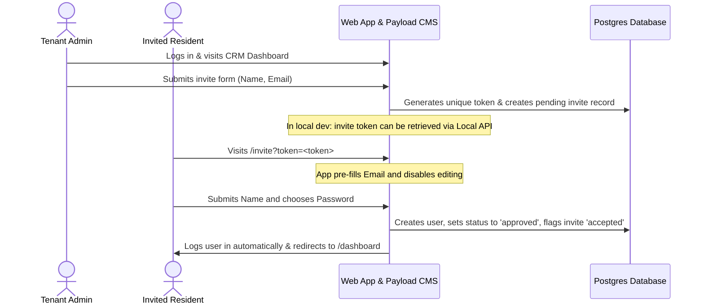

# Demo Guide: User Invite & Acceptance Staging Flow

This guide provides step-by-step instructions for demonstrating the user invitation and registration flow within the multi-tenant neighborhood portal. 

---

## 📋 Overview of the Workflow



---

## 🛠️ Prerequisites

1. Make sure your local Postgres database is running.
2. Start the local development server:
   ```bash
   pnpm dev
   ```
3. Ensure the database has been seeded. If you need to restore the snapshot:
   ```bash
   pnpm db:restore:local
   ```

---

## 🚶 Step-by-Step Demo Walkthrough

### Phase 1: Sending the Invitation (Admin)

1. Open your browser and navigate to the NOG login page:
   👉 [http://nog.localhost:3000/login](http://nog.localhost:3000/login)
2. Log in using the **Tenant Admin** credentials:
   * **Email:** `admin@nog.blockvibe.org`
   * **Password:** `nG8xP9aW`
3. Once logged in, navigate to the **Directory (CRM)** page:
   👉 [http://nog.localhost:3000/dashboard/crm](http://nog.localhost:3000/dashboard/crm)
4. Click the **Invite Resident** button to open the invitation modal.
5. Enter the following details:
   * **Name:** `Invited Resident`
   * **Email:** `invited_resident@example.com`
6. Click **Send Invite**.
7. Confirm that a success notification toast displays: **"Invite sent successfully"**.

---

### Phase 2: Retrieving the Invitation Token

> [!NOTE]
> In production, the application fires an email containing the personalized invite link. For local demonstration purposes, you can retrieve the generated token directly using the Payload API.

1. Open a new tab and navigate to:
   👉 [http://nog.localhost:3000/api/invites?where[email][equals]=invited_resident@example.com](http://nog.localhost:3000/api/invites?where[email][equals]=invited_resident@example.com)
2. Copy the value of the `token` field from the returned JSON response. For example:
   ```json
   {
     "docs": [
       {
         "id": 1,
         "email": "invited_resident@example.com",
         "name": "Invited Resident",
         "token": "4ab2c5d6e7f8g9h0...",
         "status": "pending"
       }
     ]
   }
   ```

---

### Phase 3: Accepting the Invitation (Resident)

1. Open a **Private/Incognito Window** or log out of the admin panel.
2. Navigate to the invite acceptance URL (replacing `<TOKEN_VALUE>` with the token copied in Phase 2):
   👉 `http://nog.localhost:3000/invite?token=<TOKEN_VALUE>`
3. Inspect the page layout and form:
   * The **Email** field must be pre-populated with `invited_resident@example.com` and must be **disabled** (read-only) to enforce target user integrity.
4. Enter the user details:
   * **Name:** `Invited Resident`
   * **Choose Password:** `SecureInvPass123!`
5. Click the **Join Community** button.
6. Verify that:
   * You are automatically logged in.
   * You are redirected directly to the resident dashboard: [http://nog.localhost:3000/dashboard](http://nog.localhost:3000/dashboard)
   * The greeting banner displays: **"Hello, Invited Resident"**.
   * You have access to user features (like **Voting & Polls**) and do not see admin-only dashboard features.
